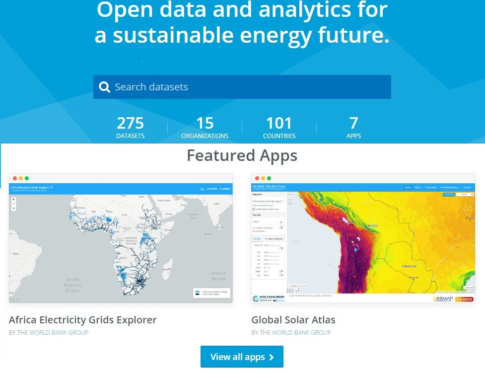

GIS data acquisition
============================

Geographic Information Systems
******************************

A Geographic Information System (GIS) is an integrated set of hardware and software tools,  designed to capture, store, manipulate, analyse, manage, and digitally present spatial (or geographic) data and related attribute information. GIS can relate information from different sources, using two key index variables space (or location) and time. Common GIS data types (models) include:

**Spatial Data:** Describe the absolute and relative location of geographic features.

    * Vectors

        - Arcs (Polylines): Line segments forming individual linear features
        - Polygons: Areas enclosed by arcs
        - Points: Single coordinate pairs

        .. image:: img/vector.png
            :width: 200px
            :height: 120px
            :align: center

    * Rasters

        - Grid-Cells: single column/row positions
        - Cell size: Resolution or else the accuracy of the data

        .. image:: img/raster.png
            :width: 200px
            :height: 120px
            :align: center

**Attribute data:** Describe characteristics of the spatial features. These characteristics can be quantitative and/or qualitative in nature.
Attribute data is often referred to as tabular data.

The selection of a particular data model, vector or raster, is dependent on the source and type of data, as well as the intended use of the data.
Certain analytical procedures require raster data while others are better suited to vector data.

GIS data in OnSSET
*******************

OnSSET is a GIS-based tool and therefore requires data in a geographical format.
In the context of the power sector, necessary data includes those on current and planned infrastructure
(electric grid networks, road networks, power plants, industry, public facilities), population characteristics (distribution, location),
economic and industrial activity, and local renewable energy flows. The table below lists all layers required for an OnSSET analysis.

.. list-table:: Required GIS datasets
   :header-rows: 1
   :widths: 10 65 25

   * - #
     - Dataset
     - Data type
   * - 1
     - Administrative boundaries
     - Polygon
   * - 2
     - Existing Medium-voltage lines
     - Lines
   * - 3
     - Planned Medium-voltage lines (Optional)
     - Lines
   * - 4
     - Distribution transformers (MV/LV)
     - Points
   * - 5
     - Substations*
     - Points
   * - 6
     - Existing High-voltage lines
     - Lines
   * - 7
     - Planned High-voltage lines (Optional)
     - Lines
   * - 8
     - Road network
     - Lines
   * - 9
     - Settlement clusters
     - Polygons
   * - 10
     - Global Horizontal Irradiation (GHI)
     - Raster
   * - 11
     - Small scale hydropower sites
     - Points
   * - 12
     - Wind velocity (m/s)
     - Raster
   * - 13
     - Travel time (min)
     - Raster
   * - 14
     - Night-time lights
     - Raster
   * - 15
     - Existing mini-grid locations
     - Points
   * - 16
     - Custom demand layer (if bottom-up approach is included)
     - Raster
   * - 17
     - Location of Health Facilities (if social uses are included)
     - Points
   * - 18
     - Location of Education Institutions (if social uses are included)
     - Points

.. note::

   * Before a model can be built, one must acquire the layers of data outlined above.

   * You are recommended to use most of the layers listed in the table above, but some of the are optional and can be omitted (see table above)

   More often than not, each layer must be acquired on its own.
   The final outcome is a .csv-file conveying all the information necessary
   to initiate an OnSSET electrification analysis.

Specific GIS datasets
**********************

The following sections outline some starting points for GIS data collection. Generally, country-specific data sources such
as the national statistics office, Ministry of Energy, power utility, etc. have the most up-to-date datasets, which should be
prioritized. Here we list some openly accessible databases.

Population/settlement clusters
------------------------------

These settlement polygons form the basis of the OnSSET analysis. A readily available dataset is available
`here <https://data.mendeley.com/datasets/z9zfhzk8cr/2>`_ for sub-Saharan African countries based on the methodology
described in `this publication <https://www.nature.com/articles/s41597-021-00897-9>`_.
*Note that these are several years old, and updated ones can be created using* `this code <https://github.com/OnSSET/Clustering>`_.

Administrative boundaries
-------------------------

Administrative boundaries are freely available for academic use and other non-commercial use from the
`Database of Global Administrative Areas (GADM) <https://gadm.org/download_country.html>`_, but best retrieved from
national statistics office or similar.

Travel time
-----------

Travel time indicates the time it takes to travel by car from any point in the country to the largest city with >50,000 people.
This dataset is typically retrieved from the `Malaria Atlas Project <https://data.malariaatlas.org/maps>`_ (check under *Accessibility* > *Global Travel Time to Cities).
Note that the data is from 2015, and newer datasets should ideally be used.

Global Horizontal Irradiation (GHI)
-----------------------------------

GHI indicates the **annual** solar resource potential in each location in a country. This can be retrieved from the
`Global Solar Atlas <https://globalsolaratlas.info/download>`_. Look for a file called
*Gis data - LTAym_YearlyMonthlyTotals (GeoTIFF)*.

Note that in some countries only the **daily** solar resource is available. In this case, look for a file called
*GHI - LTAym_DailySum (GeoTIFF)*, which then needs to be multiplied by 365 using the Raster calculator in QGIS or similar before use.

Wind Velocity
-------------

The average annual wind speed (m/s) can be retrieved from the `Global Wind Atlas <https://globalwindatlas.info/en/download/gis-files>`_.
Make sure to select the country, for *layer* select **WIND-SPEED**, and for *height* select **50**.

Hydro-power potential
---------------------

The hydro-power potential dataset indicates locations where *small and mini-hydropower* can be installed for mini-grids
(i.e. *not* large-scale hydropower for supplying the national grid). A version for sub-Saharan Africa is available
`here <https://energydata.info/dataset/small-and-mini-hydropower-potential-in-sub-saharan-africa>`_ based on the methodology described in
`this publication <https://www.mdpi.com/1996-1073/11/11/3100>`_.
*Note that the dataset is quite old and new updates should be undertaken if no country-specific dataset is available.*

GIS databases
*************

The following lists some important GIS databases where much data can be retreieved

EnergyData.info
---------------

Every day governments, private sector and development aid organizations collect data to inform, prepare and implement policies and investments.
Yet, while elaborate reports are made public, the data underpinning the analysis remain locked in a computer out of reach.
Because of this, the tremendous value they could bring to public and private actors in data-poor environments is too often lost.

`Energydata.info <https://energydata.info>`_ is an open data platform by The World Bank Group and several partners, trying to change energy data paucity.
It has been developed as a public good available to governments, development organizations, non-governmental organizations, academia,
civil society and individuals to share data and analytics that can help achieving universal access to modern energy services.
The database considers a variety of open, geospatial datasets of various context and granularity, including many datasets
on existing power infrastructure.

Humanitarian Data Exchange
--------------------------

`The Humanitarian Data Exchange (HDX) <https://data.humdata.org/dataset>`_ is an open platform for sharing data across crises and organisations.
It contains much useful data, including GIS data. In particular, it contains administrative boundaries,
health and education locations, and links to other similar projects.

Geofabrik / OpenStreetMap
-------------------------

The `Geofabrik <https://download.geofabrik.de/>`_ server has data extracts from the OpenStreetMap project which are
normally updated every day. You can find data for any country here. In particular, it includes road data. OpenStreetMap
also provide data such as substations. in case not available anywhere else.

Country specific databases
+++++++++++++++++++++++++++

With geospatial analysis gaining momentum in many research areas, many countries have set up their own geo-databases
in an effort to facilitate interdisciplinary research activities under a geospatial context. Here are few examples of
country-specific databases useful for electricity planning:

.. list-table:: Required GIS datasets
   :header-rows: 1

   * - Database
     - Countries
   * - `Energy Access Explorer <https://www.energyaccessexplorer.org/>`_
     - India, Nigeria, Zambia, Kenya, Nepal, Tanzania, Ethiopia, Uganda
   * - `Madagascar Integrated Energy Access Planning Tool <https://madagascar-iep.sdg7energyplanning.org/en/>`_
     - Madagascar
   * - `Energy Sector GIS Working Group <https://energy-gis.ug/gis-maps>`_
     - Uganda

