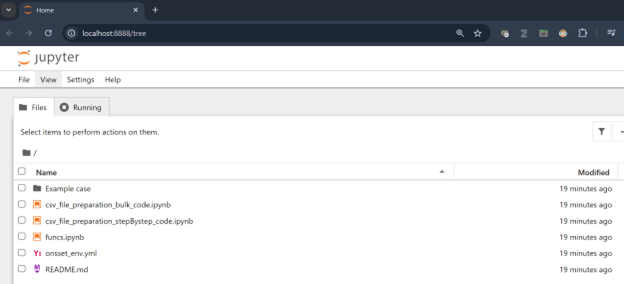
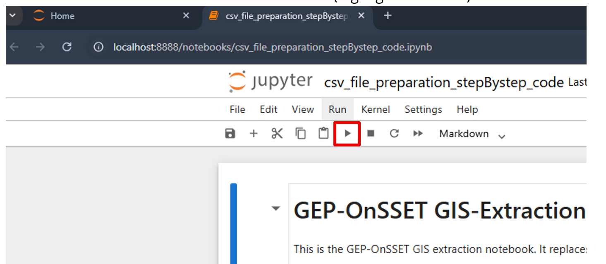
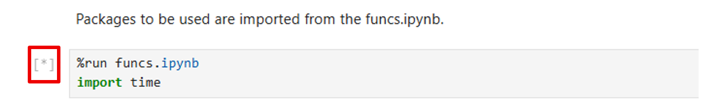
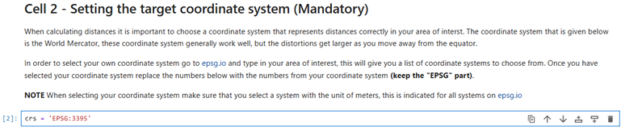
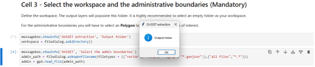
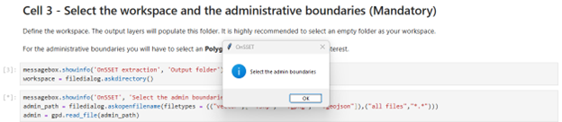
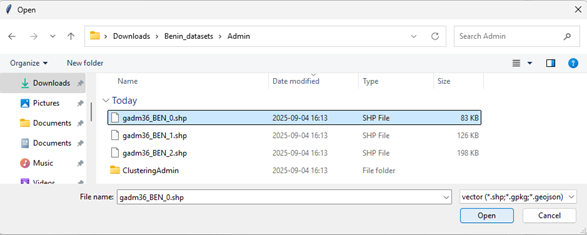
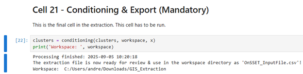
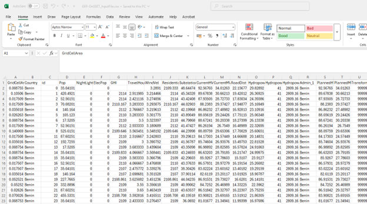

GIS data preparation
========================

Once all necessary layers have been succesfully acquired, the user would need to prepare the datasets for their input
into the OnSSET model. This requires the creation of a .csv file. There are four steps that need to be undertaken to
process the GIS data so that it can be used for an OnSSET analysis.

**Step 1. Proper data types and coordinate system**
---------------------------------------------------

In this first step the user would need to secure all the datasets. Before starting the analysis make sure that all
datasets are in the **World Geodetic Datum 1984 (WGS84) / EPSG:4326** coordinate system.
You can check the coordinate system of your layers by importing them into QGIS and then right-clicking on them and open
the **Properties** window. In the Properties window go to the **Information** tab, here the coordinate system used is
listed under *CRS* for both rasters and vectors.

**Step 2. Layer projection**
---------------------------------------------------

In this step the user would need to determine the projection system he/she wish to use. Projection systems always
distort the datasets and the system chosen should be one that minimizes this distortion. **Do not** manually project
the datasets yourself (the Jupyter Notebook presented below does this for you). However, it is good to have an idea of
which system to use before starting to work with the datasets. Here follows a few important key aspects:

**Projection** is the systematic transformation of the latitude and longitude of a location into a pair of two
dimensional coordinates or else the position of this location on a plane (flat) surface. You will need to select
a coordinate system that is measured in **meters** and appropriate for you region of interest. You can browse coordinate
systems at `EPSG.io <https://epsg.io/>`_. Search for your country or region, check that the *Unit* is meters and note
down the epsg code.

**Step 3. Generate the OnSSET input file**
---------------------------------------------------

Here, the goal is to take all of the GIS layers that have been collected, and extract the neccessary information
to each settlement, which will be saved in a csv-file to be used for running scenarios in the next step.

First, you need to download the codes from `here <https://github.com/OnSSET/OnSSET_GIS_Extraction_notebook>`_
(click on **Code** and *Download zip* or clone the repository using Git).

To launch the Jupyter Notebook, open **Anaconda Prompt** and run the following commands:

.. code-block:: bash

   cd PATH
   conda activate onsset_env
   jupyter notebook

Replace ``PATH`` with the location on your computer where you downloaded and extracted
the folder containing the OnSSET GIS Extraction codes.

This will open Jupyter in your browser. Note that everything is still running locally;
the browser is simply used as the interface.

Open the Notebook
-----------------

Click on the notebook called **csv_file_preparation_stepBystep_code.ipynb**

   Opening the GIS extraction notebook.

Running Cells
-------------

Click on the **Run** button to run the selected cell (highlighted in blue).

   Running a selected cell in Jupyter Notebook.

Importing Packages
------------------

The first cell imports the necessary packages and scripts.

If you receive an error message here, it typically means:

* Something went wrong with the installation, or
* The environment was not activated before launching the notebook.

While a cell is executing, a ``*`` appears on the left side of the cell.
Once execution finishes, it is replaced by a number (for example ``[1]``).

Cells containing only text will not show a star or a number.

   Importing required packages.

Define Coordinate System
------------------------

In the next cell, define the coordinate system.

You can keep the default or change to the one identified in step 2 (sometimes not all coordinate systems work,
so it is suggested to run first with the generic 3395 and then run again with the area-specific one):

   Selecting the coordinate system.

Run the cell to proceed.

Select Output Folder
--------------------

In the following cell, create or select an empty folder where the results will be saved.

When you run the cell, a pop-up window will appear asking you to select the folder.

   Selecting the output folder.

Selecting Input Datasets
------------------------

Next, you will select the required GIS datasets.

Administrative Boundaries
^^^^^^^^^^^^^^^^^^^^^^^^^

Select the administrative boundaries layer:

Population Clusters
^^^^^^^^^^^^^^^^^^^

Select the population clusters layer:

::

   E.g. Benin_datasets > Clusters > Benin.shp

After selecting the file, another pop-up will appear asking you to select the
population column.

Choose:

::

   Population

Dataset Selection by Cell
-------------------------

Continue running the cells and select the datasets according to the list below.

If a dataset is not available in the training exercise, simply click **Cancel**.

**Cell 5**

::

   E.g. Benin_datasets > Solar > GHI.tif

**Cell 6**

::

   E.g. Benin_datasets > Traveltime > Traveltime.tif

**Cell 7**

::

   E.g. Benin_datasets > windvel > windvel.tif

**Cell 8**

::

   E.g. Benin_datasets > NightLights > NightLights.tif

**Cell 9**

::

   E.g. Benin_datasets > CustomDemand > CustomizedDemand2.tif

**Cell 10**

No selection required.

**Cell 11**

::

   E.g. Benin_datasets > Substations > substations.shp

**Cell 12**

::

   E.g. Benin_datasets > HV > Existing.shp

**Cell 13**

::

   E.g. Benin_datasets > HV > Planned.shp

**Cell 14**

::

   E.g. Benin_datasets > MV > Existing.shp

**Cell 15**

::

   E.g. Benin_datasets > MV > Planned.shp

**Cell 16**

::

   E.g. Benin_datasets > Roads > roads.shp

**Cell 17**

::

   E.g. if not available — click **Cancel**.

**Cell 18**

::

   E.g. Benin_datasets > Hydro > hydro_points.shp

When prompted, select:

1. ``PowerMW``
2. ``MW``

**Cell 19**

::

  E.g. if not available — click **Cancel**.

**Cell 20**

::

   E.g. Benin_datasets > Admin > GADM36_BEN_1.shp

When prompted, select:

::

   NAME_1 (or other based on your dataset)

Exporting the Results
---------------------

**Cell 21**

This the final step. Running this cell exports the processed data into a CSV file. If everything works correctly you
will see the *Processing finished* message and the file will be saved in the output folder you selected earlier:

Understanding the Output
------------------------

In the generated CSV file:

* Each row represents one settlement.
* Each column represents an attribute used in the OnSSET model.

To understand the meaning of each column, refer to the table below or
`this document <drive.google.com/file/d/1vnmBWJuY1vwSErGKa64DUlEZtf7m72MR/view>`_
which also indicates the expected values in each column.

This CSV file is the final result of the GIS extraction process and will be
used in the next exercise to run OnSSET.

GIS country file
------------------------------
The table below shows all the parameters that should be sampled and put into the csv file representing the study area.

+-----------------------------+----------------------------------------------------------------------------------------------------------------------------------------------------------+
| **Parameter**               | **Description**                                                                                                                                          |
+=============================+==========================================================================================================================================================+
| Country                     | Name of the country                                                                                                                                      |
+-----------------------------+----------------------------------------------------------------------------------------------------------------------------------------------------------+
| Nigthlights                 | Maximum light intensity observed in cluster                                                                                                              |
+-----------------------------+----------------------------------------------------------------------------------------------------------------------------------------------------------+
| Pop                         | Population of cluster                                                                                                                                    |
+-----------------------------+----------------------------------------------------------------------------------------------------------------------------------------------------------+
| id                          | Id of cluster, important when generating maps                                                                                                            |
+-----------------------------+----------------------------------------------------------------------------------------------------------------------------------------------------------+
| GridCellArea                | Area of each cluster (km2)                                                                                                           			 |
+-----------------------------+----------------------------------------------------------------------------------------------------------------------------------------------------------+
| ElecPop                     | Population that lives in areas with visible night-time lights                                                          					 |
+-----------------------------+----------------------------------------------------------------------------------------------------------------------------------------------------------+
| WindVel                     | Wind speed (m/s)                                                                                                                                         |
+-----------------------------+----------------------------------------------------------------------------------------------------------------------------------------------------------+
| GHI                         |      Global Horizontal Irradiation (kWh/m2/year)                                                                                                         |
+-----------------------------+----------------------------------------------------------------------------------------------------------------------------------------------------------+
| TravelHours                 | Distance to the nearest town (hours)                                                                                                                     |
+-----------------------------+----------------------------------------------------------------------------------------------------------------------------------------------------------+
| ResidentialDemandTierCustom | Indicative residential electricity demand target                                                                                                         |
+-----------------------------+----------------------------------------------------------------------------------------------------------------------------------------------------------+
| Elevation                   | Elevation from sea level (m)                                                                                                                             |
+-----------------------------+----------------------------------------------------------------------------------------------------------------------------------------------------------+
| Slope                       | Ground surface slope gradient (degrees)                                                                                                                  |
+-----------------------------+----------------------------------------------------------------------------------------------------------------------------------------------------------+
| LandCover                   | Type of land cover as defined by the source data                                                                                                         |
+-----------------------------+----------------------------------------------------------------------------------------------------------------------------------------------------------+
| CurrentHVLineDist           | Distance to the closest existing HV line (km)                                                                                                   	 |
+-----------------------------+----------------------------------------------------------------------------------------------------------------------------------------------------------+
| CurrentMVLineDist           | Distance to the closest existing MV line (km)                                                                                                    	 |
+-----------------------------+----------------------------------------------------------------------------------------------------------------------------------------------------------+
| PlannedHVLineDist           | Distance to the closest planned HV line (km)                                                                                                             |
+-----------------------------+----------------------------------------------------------------------------------------------------------------------------------------------------------+
| PlannedMVLineDist           | Distance to the closest planned MV line (km)                                                                                                		 |
+-----------------------------+----------------------------------------------------------------------------------------------------------------------------------------------------------+
| TransformerDist             | Distance from closest existing transformers (km)                                                                                                         |
+-----------------------------+----------------------------------------------------------------------------------------------------------------------------------------------------------+
| SubstationDist              | Distance from the existing sub-stations (km)                                                                                                             |
+-----------------------------+----------------------------------------------------------------------------------------------------------------------------------------------------------+
| RoadDist                    | Distance from the existing road network (km)                                                                                                 		 |
+-----------------------------+----------------------------------------------------------------------------------------------------------------------------------------------------------+
| HydropowerDist              | Distance from closest identified hydropower potential (km)                                                                                               |
+-----------------------------+----------------------------------------------------------------------------------------------------------------------------------------------------------+
| Hydropower                  | Closest hydropower technical potential identified                                                                                                        |
+-----------------------------+----------------------------------------------------------------------------------------------------------------------------------------------------------+
| HydropowerFID               | ID of the nearest hydropower potential                                                                                                                   |
+-----------------------------+----------------------------------------------------------------------------------------------------------------------------------------------------------+
| X_deg                       | Longitude                                                                                                              					 |
+-----------------------------+----------------------------------------------------------------------------------------------------------------------------------------------------------+
| Y_deg                       | Latitude                                                         										 	 |
+-----------------------------+----------------------------------------------------------------------------------------------------------------------------------------------------------+
| IsUrban                     | All 0 after extraction, urban/rural split gets assigned in the algorithm                                                                                 |
+-----------------------------+----------------------------------------------------------------------------------------------------------------------------------------------------------+
| PerCapitaDemand             | Indicative residential electricity demand target                                                                                                         |
+-----------------------------+----------------------------------------------------------------------------------------------------------------------------------------------------------+
| HealthDemand                | Indicative electricity demand for health 														 |
+-----------------------------+----------------------------------------------------------------------------------------------------------------------------------------------------------+
| EducationDemand             | Indicative electricity demand for educational facilities                                                                                                 |
+-----------------------------+----------------------------------------------------------------------------------------------------------------------------------------------------------+
| AgriDemand                  | Indicative electricity demand for agricultural processes                                                                                                 |
+-----------------------------+----------------------------------------------------------------------------------------------------------------------------------------------------------+
| ElectrificationOrder        | Indicates order of electrification; retrieved by grid extension algorithm; default =0                                                                    |
+-----------------------------+----------------------------------------------------------------------------------------------------------------------------------------------------------+
| Conflict                    | Indicator of level of conflict (default =0; otherwise option 1-4)                                                                                        |
+-----------------------------+----------------------------------------------------------------------------------------------------------------------------------------------------------+
| CommercialDemand            | Indicative electricity demand target for commercial activity                                                                                             |
+-----------------------------+----------------------------------------------------------------------------------------------------------------------------------------------------------+
| ResidentialDemandTier1      | Indicative residential electricity demand target equal to Tier 1                                                                                         |
+-----------------------------+----------------------------------------------------------------------------------------------------------------------------------------------------------+
| ResidentialDemandTier2      | Indicative residential electricity demand target equal to Tier 2                                                                                         |
+-----------------------------+----------------------------------------------------------------------------------------------------------------------------------------------------------+
| ResidentialDemandTier3      | Indicative residential electricity demand target equal to Tier 3                                                                                         |
+-----------------------------+----------------------------------------------------------------------------------------------------------------------------------------------------------+
| ResidentialDemandTier4      | Indicative residential electricity demand target equal to Tier 4                                                                                         |
+-----------------------------+----------------------------------------------------------------------------------------------------------------------------------------------------------+
| ResidentialDemandTier5      | Indicative residential electricity demand target equal to Tier 5                                                                                         |
+-----------------------------+----------------------------------------------------------------------------------------------------------------------------------------------------------+

.. note::
    It is very important that the columns in the csv-file are named exactly as they are namned in the **Parameter**-column in the table above.
