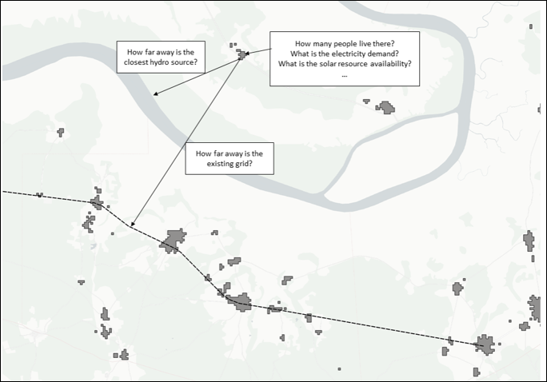
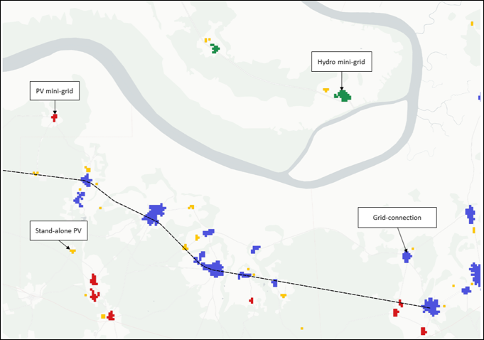

The OnSSET Model
================

This section presents the overall methodology of the OnSSET tool, based on an excerpt of the PhD thesis
`New methods and applications to explore the dynamics of least-cost technologies in geospatial electrification modelling
<https://www.diva-portal.org/smash/record.jsf?pid=diva2%3A1803844&dswid=-8540>`_ by A. Sahlberg (2023):

The electrification problem consists of solving four distinct problems to identify which technology can supply the
electricity demand in each location at the lowest cost
`Ciller and Lumbreras (2020) <https://www.sciencedirect.com/science/article/abs/pii/S1364032119308317>`_: 1) assigning households and other
demand nodes into relevant clusters to evaluate the least-cost technology for, 2) calculate the distribution network
required within each cluster (depending on technology), 3) identify the network for new grid-extension and 4) selecting
the least-cost technology in each cluster. The following steps are undertaken to perform all of these tasks using the
OnSSET tool:

    The first step is to create the settlements that form the basis of the analysis. High-resolution population data is clustered into vector polygons.

    In the second step of the analysis, geospatial information is collected and extracted to each of the settlements in
    the analysis. This includes e.g. information about the energy resource availability, distance to roads and
    existing power infrastructure (e.g. MV lines, LV lines, substations, distribution transformers and mini-grids), land
    cover, elevation and night-time lights, locations of other electricity demands such as schools and health facilities.
    Note that the geospatial information required varies depending on the scope of the study.

Geospatial information used in geospatial electrification modelling to understand settlement characteristics

    Once the geospatial data has been processed, the settlements that are already electrified are identified. As this
    information is usually not available as a geospatial dataset, night-time lights, population data and existing
    infrastructure GIS data are used to calibrate the model against the national statistical electrification rate.
    Settlements with night-time lights that are close to the existing power infrastructure are considered likely to be
    electrified. Furthermore, a settlement can be considered 35 partially electrified if there is only night-time lights
    in some areas of the settlement (identified by overlaying the raster night-time light data with the raster population
    data during the creation of population settlements in step 1).

    In the fourth step, the model is calibrated and can be used to run scenarios. The first
    step of a scenario is to project the population growth for the years of analysis (based on urban and rural population
    growth rates), and to estimate the electricity demand in each settlement. The demand estimate can be performed using
    different target levels e.g. for urban and rural settlements, by classification based on socio-economic information
    such as GDP and poverty rates, or any other method. Often, demand estimations are used in the context of the
    Multi-Tier Framework (MTF) (`Bhatia and Angelou, 2015 <https://openknowledge.worldbank.org/entities/publication/a896ab51-e042-5b7d-8ffd-59d36461059e>`_), which define five Tiers of electricity access that enable
    various electricity services. Additionally, the model is equipped to be able to include demand from other
    sectors as well, assuming such information is available.

    Once the demand has been estimated in each settlement, the least-cost off-grid technology is identified. The
    selection of technologies is based on the technology that can meet the demand at the lowest Levelized Cost of
    Electricity (LCOE). The LCOE takes into account all of the costs (investment, fuel, operation and maintenance) over
    the project life-time divided by the electricity demand supplied to calculate the cost of electricity (USD/kWh) for
    the project to break even. The LCOE concept is useful to compare technologies with different cost structures
    (`Nerini et al., 2016 <https://doi.org/10.1016/j.energy.2015.11.068>`_).

    When the least-cost off-grid technology has been identified in each settlement, a grid-extension algorithm
    identifies where extension of the centralized grid network can supply electricity at a lower cost than the least-cost
    off-grid alternative (taking into account both the cost of extending the grid lines there, the distribution network
    required within the settlement, and the generation cost of electricity for the centralized grid). Following this step,
    the least-cost technology has been identified in all settlements.

Final least-cost technology selection

    The OnSSET tool is equipped with a time-step functionality. If the target electrification rate is less than 100%,
    the settlements that should be electrified first are identified based on the user-specified prioritization (e.g. the
    settlements with the lowest LCOE, or the most accessible settlements). This then serves as a starting point for the
    next time-step, which starts again from step 4.
