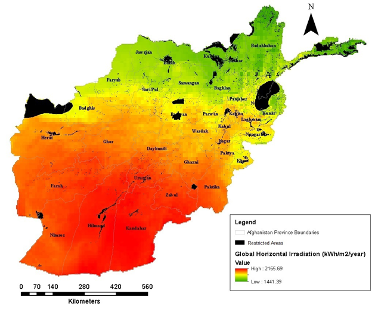
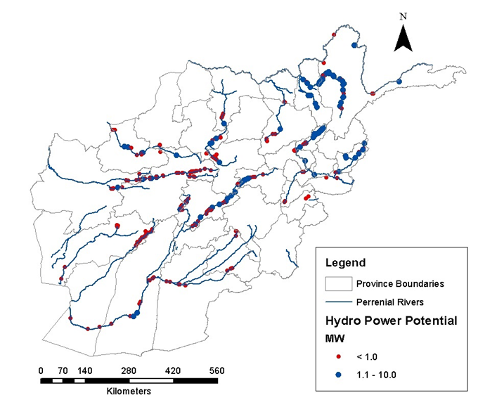
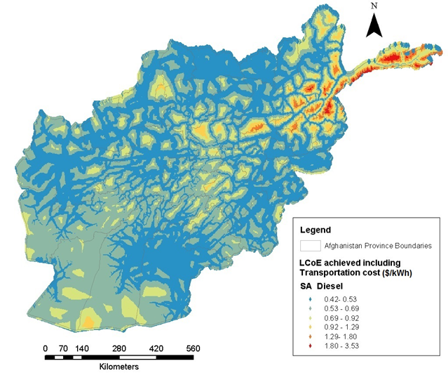
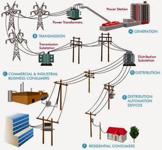

The OnSSET Model
================

The following paragraphs describe in brief how an electrification anaysis with OnSSET works.

Electricity demand
*******************
The goal of OnSSET is clear, to identify the mix of technologies that will help to fully electrify the population of a country within a certain timeframe. Currently, OnSSET only accounts for residential electricity demand.

Geo-location of population and current electrification status
-------------------------------------------------------------
Using population density maps, OnSSET can identify where population is located whithin the study area. Depending on the number of people living in a settlement, OnSSET categorizes a settlement as either urban or rural. Other geospatial information such as the distance between a settlement and its closest electricity grid, its distance from closest transformer, population density and its brightness index at night (from satellite imagery), helps OnSSET identify the current electrification status per settlement. Each settlement is characterized as electrified or un-electrified.

    .. image::  img/AfghanElec.png
        :scale: 80 %
        :align: center

Residential Electricity Demand
------------------------------
Once the electrified and un-electrified population has been spatially identified, OnSSET uses population growth rates per type of settlement (urban/rural) to estimate the projected population at the end year of the analysis (e.g. 2030). This is one of the two parameters we need to know to quantify and locate the future electricity demand. The second parameter is the target level of electricity; OnSSET adopts the consumption levels suggested by the Global Tracking Framework (2015).

    .. image::  img/TierFramework.png
        :scale: 80 %
        :align: center

Consumption levels start from 8 kWh/person/year, enough to support minor daily activities (few hours of lighting, phone charging, radio etc.) and reach up to 598 kWh/person/year, supporting the use of heavier or continuous appliances in a household like refrigerator, washing machine, oven etc. These values can easily be changed in the OnSSET model in order to better fit the study area of your choice. The combination of projected population and targeted consumption level, indicates the electricity demand for residential purposes per location. 

Note, that OnSSET provides the option of determining the demand either through a top-down approach or a bottom-up one. In the top-down approach the user selects which tier the urban and rural settlements reach respectively and the demand in each settlement is determined as:

                        **Electricity Demand = Population in 2030 X Selected Access Tier**
                        
In the bottom-up approach the user can use a combination of different GIS-datasets (e.g. GDP and poverty) in order to generate a custom demand estimate for each settlement. This approach requires the user to generate a demand layer and gives more dissagregated measure of deamnd than the urban-rural division in the top-down approach.

Furthermore, the user can add other demand sectors, including health, education, commercial and agriculture.

Electricity supply
******************

OnSSET uses GIS to seize location specific information of power infrastructure. It also relies on GIS data in order to grasp the spatial and temporal fluctuation of energy resources. All these data, are later translated into techno-economic inputs and are very useful in assessing the performance of various technologies.

Energy resources assessment
---------------------------

**Wind energy potential and capacity factors**

Wind speed data extracted into a GIS environment are used to calculate wind turbine capacity factors per location.
The latter is defined as the ratio of the yearly expected wind energy production to the energy production if the
wind turbine were to operate at its rated power throughout the year.
The capacity factor reflects the potential wind power at a given site and it can be used for comparing different sites before the installation of wind power plants.
Additional documentation on wind power assessment is available `here <https://github.com/OnSSET/OnSSET/tree/master/Resource_Assessment/Wind>`_.

.. image::  img/AfghanCF.png
    :scale: 80 %
    :align: center

**Solar energy potential**

GIS data for Global Horizontal Irradiation (GHI - kWh/m^2/time) are used to indicate the available solar energy that Photovoltaic (PV) systems can utilize per location. Documentation on solar power assessment is available `here <https://github.com/OnSSET/OnSSET/tree/master/Resource_Assessment/Solar>`_.

**Hydropower potential**

A number of GIS datasets (runoff, accumulation, elevation, river network) have been utilized in a novel methodology developed by KTH dES in order to spatially identify potential sites for small scale hydropower deployment. Documentation on hydropower assessment together with a GIS based assessment tool is available `here <https://github.com/OnSSET/OnSSET/tree/master/Resource_Assessment/HydroPower>`_.

**Transportation Cost for Diesel**

Diesel is an important energy carrier, especially in remote areas of many developing countries and is therefore included in the OnSSET analysis. Transportation of diesel incurs costs, which may lead to high costs of electricity for isolated and low populated communities. OnSSET uses GIS datasets that indicate travel time and distance from main urban hubs, in order to calculate and assign transportation costs for diesel in each location. These costs are then included as fuel costs in the calculation of LCoE for diesel gensets. Documentation on diesel cost assessment is available `here <https://github.com/OnSSET/OnSSET/tree/master/Resource_Assessment/DieselCost>`_.

Electrification options
-----------------------

Over the last few decades, access to electricity in many parts of the world has been primarily achieved through the extension of the national electricity grid. Levereging on economies of scale, centralized grids offer electricity at low costs. Power grid expansion is however a capital intensive and lenthy process. In contrary, decentralized power system configurations i.e. mini-grids or stand-alone systems may be a better fit for electrification of remote, sparsely populated areas. Technological advances over the past decades along with innovative business models, have made such systems rather cost competitive. In addition, if based on local renewable sources they increase supply reliability while decreasing reliance on imported fuels.

OnSSET estimates and compares the performance of seven technology configurations that fall within three main categoroes: grid-extension, mini-grids and stand-alone systems.

**Grid extension**
----------------

Central grids can offer low generating costs. However, grid extension might not be economically or socially
feasible if the purpose is to meet a relatively small electricity demand or reaching remotely located areas.

**Mini-grids** - Wind Turbines, Solar PVs, Mini/Small Hydro, Diesel generators
-------------------------------------------------------------------------------

Mini-grids usually provide electricity from small power plants with generating capacity of a few MW. They tap locally available energy resources such as solar, hydro, wind, or can use commonly available fuels such as diesel. Overall, they can provide affordable electricity to rural and remote areas with low to medium electricity consumption habits. Cost-wise, if based on renewable sources, they usually have moderate to high upfront investment costs but small operational monetary costs and no fuel costs. On the other hand, diesel generator sets (gensets) are a mature technology with low upfront investment cost but subjected to operational costs depending on diesel pump price and transport costs fluctuations.

    .. image::  img/MiniGrid.png
        :scale: 85 %
        :align: center

**Stand-alone systems (SA)** - Solar PVs, Diesel generators
-----------------------------------------------------------

Like mini-grids, these systems are usually based on local energy resources but the difference is that these can produce
only few kWh per day, suitable to cover the electricity demand of a single household or a small business, but no more.
Stand-alone systems do not require a T&D network nor construction investments. The capital cost of these systems is
not high and depends mainly on size. Batteries, allowing for electricity when dark, may increase the upfront cost for PV systems.

    .. image::  img/StandAlone.png
        :scale: 85 %
        :align: center

Methodology Overview
********************

    .. image::  img/Methodology.png
        :align: center

**Brief description of the electrification algorithm**

The electrification algorithm procedure is based on two separate, yet complementary processes. On the one hand, a GIS
analysis is required to obtain a settlement table referencing each settlement’s position –i.e., its x and y coordinates
– and information related to demand, resource availability, infrastructure and economic activities. Night-time light
datasets are used in combination with population density and electricity related infrastructure (transformers, transmission lines and distribution lines) in
order to identify the presently electrified population. The initial electrification status is listed as either 1
(electrified) or 0 (non-electrified).

The algorithm calculates the cost of generating electricity at each cell for different electrification configurations
based on the local specificities and cost related parameters. Depending on the electricity demand, transmission and distribution
network requirements, energy resource availability etc. the LCoE for each of the seven technology configurations is
calculated in each settlement. The LCoE of a specific technology configuration represents the final cost of electricity required for
the overall system to break even over the project lifetime.

.. note::

    The LCoE calculations for the mini-grid and standalone electrification options reflect the total system costs while
    the LCoE for the grid option is the sum of the average LCoE of the national grid plus the marginal LCoE of
    transmitting and distributing electricity from the national grid to the demand location.

Once the LCoEs for all the off-grid technology configurations have been calculated the grid extension algorithm is
executed. For each cell electrified by the national grid the algorithm iterates through all
non-electrified cells to test if the conditions for their connection to the electrified settlement are fulfilled.
These conditions include: a) lower cost of generating, transmitting and distributing electricity as compared to the off-grid
technologies and b) not causing the total additional MV grid length to exceed 50 km if it is connected.

If these conditions are fulfilled, the settlement status is set to electrified (by the national grid). At the same time, the algorithm
stores the length of the additional MV lines that have been built thus far by the model to connect this new settlement.
This is required to ensure all newly electrified cells comply with the 50 km limit for the length of MV lines. Further,
this is also used to consider cost increases for each additional MV extension, due to the requirement to strengthen the
previously built grid line. This process is repeated with the newly electrified cells until no additional cells are being
electrified, and thus until all settlements to which the grid can be economically extended are reached. Settlements that
are not connected to the grid will get access to electricity through mini grid or stand-alone systems. This decision is
based on a cost comparison process where the off-grid technology which can meet the electricity demand at the lowest LCoE
selected for each cell.

**Penalty cost assignment to electricity grid expansion processess**

The expansion of the transmission network to areas lacking access is a capital intensive process. The investment costs
are influenced by several factors such as the capacity and the length of the lines as well as by the topology
of the subjected area. In this analysis, a number of geospatial factors that affect the investment costs of the
transmission network are identified and considered in order to assign an incremental capital cost in locations that
indicate specific topological features. Particularly, investment cost is influenced by elevation, the road network,
land cover type, slope gradient and distance from substations.
