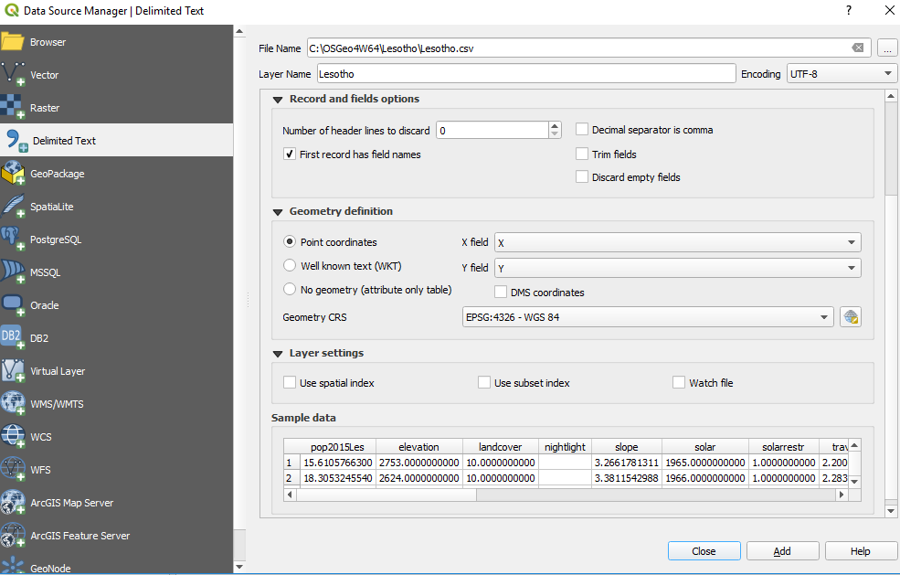
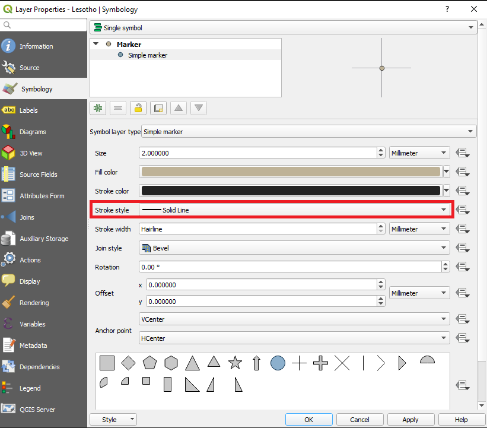
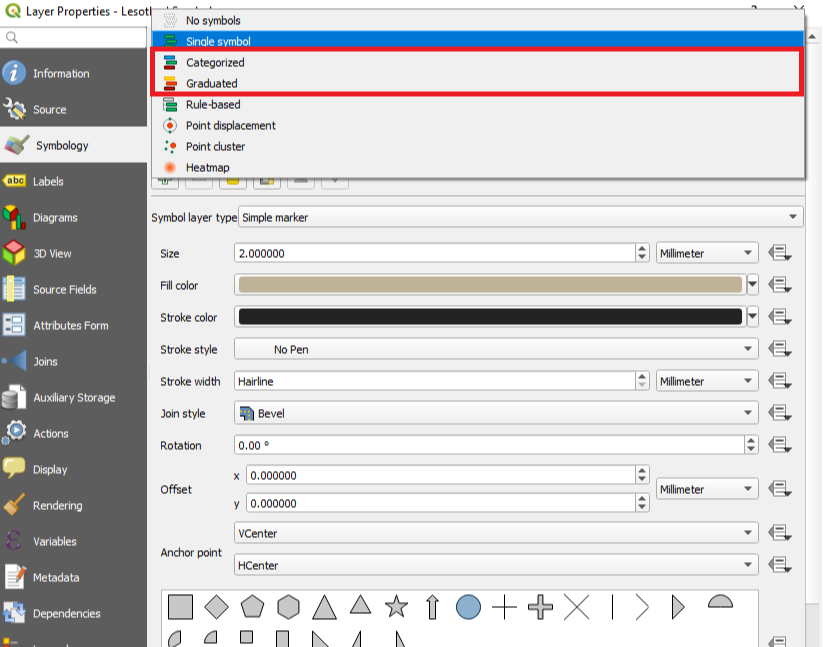
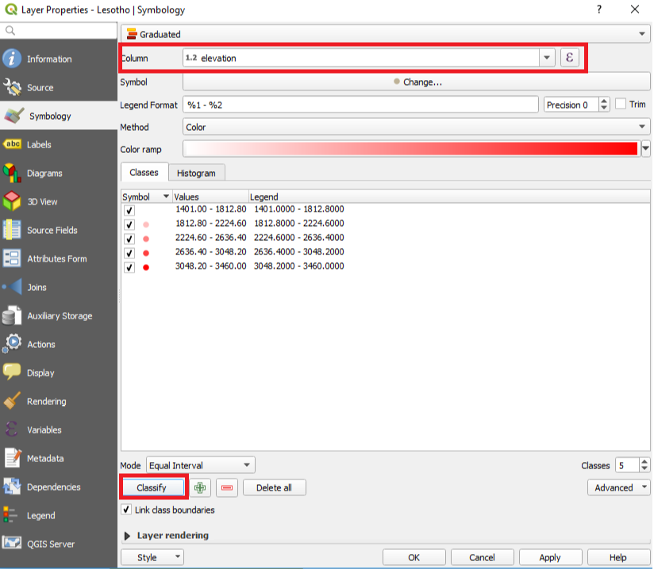

Analysis and visualizations
=============================

The output of the analysis are two csv files. One large file containing data for each geolocated cell and one smaller file
with summarized data.

Output parameters
******************************

The following table displays the parameters included in the excel file that includes all the grid cells. The first 18 parameters
come from the input csv file while the remaining stem from running the Python code.

+--------------------------+----------------------------------------------------------------------------------------------------------------------------------------------------------+
| Parameter                | Description                                                                                                                                              |
+==========================+==========================================================================================================================================================+
| Country                  | Name of the country                                                                                                                                      |
+--------------------------+----------------------------------------------------------------------------------------------------------------------------------------------------------+
| Pop                      | Population in base year                                                                                                                                  |
+--------------------------+----------------------------------------------------------------------------------------------------------------------------------------------------------+
| X                        | Longitude                                                                                                                                                |
+--------------------------+----------------------------------------------------------------------------------------------------------------------------------------------------------+
| Y                        | Latitude                                                                                                                                                 |
+--------------------------+----------------------------------------------------------------------------------------------------------------------------------------------------------+
| GHI                      | Global Horizontal Irradiation (kWh/m2/year)                                                                                                              |
+--------------------------+----------------------------------------------------------------------------------------------------------------------------------------------------------+
| SolarRestriction         | Defines if an areas is restricted to solar PV deployment (1: restricted, 0: non restricted)                                                              |
+--------------------------+----------------------------------------------------------------------------------------------------------------------------------------------------------+
| WindVel                  | Wind speed (m/s)                                                                                                                                         |
+--------------------------+----------------------------------------------------------------------------------------------------------------------------------------------------------+
| TravelHours              | Distance to the nearest town (hours)                                                                                                                     |
+--------------------------+----------------------------------------------------------------------------------------------------------------------------------------------------------+
| NightLights              | Nighttime light intensity (0-63)                                                                                                                         |
+--------------------------+----------------------------------------------------------------------------------------------------------------------------------------------------------+
| Elevation                | Elevation from sea level (m)                                                                                                                             |
+--------------------------+----------------------------------------------------------------------------------------------------------------------------------------------------------+
| Slope                    | Ground surface slope gradient (degrees)                                                                                                                  |
+--------------------------+----------------------------------------------------------------------------------------------------------------------------------------------------------+
| LandCover                | Type of land cover as defined by the source data                                                                                                         |
+--------------------------+----------------------------------------------------------------------------------------------------------------------------------------------------------+
| GridDistCurrent          | Distance from the existing electricity grid network (km)                                                                                                 |
+--------------------------+----------------------------------------------------------------------------------------------------------------------------------------------------------+
| GridDistPlan             | Distance from the planned electricity grid network (km)                                                                                                  |
+--------------------------+----------------------------------------------------------------------------------------------------------------------------------------------------------+
| SubstationDist           | Distance from the existing sub-stations (km)                                                                                                             |
+--------------------------+----------------------------------------------------------------------------------------------------------------------------------------------------------+
| RoadDist                 | Distance from the existing and planned road network (km)                                                                                                 |
+--------------------------+----------------------------------------------------------------------------------------------------------------------------------------------------------+
| HydropowerDist           | Distance from identified hydropower stations (km)                                                                                                        |
+--------------------------+----------------------------------------------------------------------------------------------------------------------------------------------------------+
| Hydropower               | Closest hydropower technical potential identified                                                                                                        |
+--------------------------+----------------------------------------------------------------------------------------------------------------------------------------------------------+
| X_deg                    | Longitude in degrees                                                                                                                                     |
+--------------------------+----------------------------------------------------------------------------------------------------------------------------------------------------------+
| Y_deg                    | Latitude in degrees                                                                                                                                      |
+--------------------------+----------------------------------------------------------------------------------------------------------------------------------------------------------+
| RoadDistClassified       | Classification of the distance from road network based on a suitability index ranging from 1 to 5 (1 implying the lowest suitability)                    |
+--------------------------+----------------------------------------------------------------------------------------------------------------------------------------------------------+
| SubstationDistClassified | Classification of the distance from sub-stations based on a suitability index ranging from 1 to 5 (1 implying the lowest suitability)                    |
+--------------------------+----------------------------------------------------------------------------------------------------------------------------------------------------------+
| LandCoverClassified      | Classification of the land cover based on a suitability index ranging from 1 to 5 (1 implying the lowest suitability)                                    |
+--------------------------+----------------------------------------------------------------------------------------------------------------------------------------------------------+
| ElevationClassified      | Classification of the elevation value based on a suitability index ranging from 1 to 5 (1 implying the lowest suitability)                               |
+--------------------------+----------------------------------------------------------------------------------------------------------------------------------------------------------+
| SlopeClassified          | Classification of the slope gradient based on a suitability index ranging from 1 to 5 (1 implying the lowest suitability)                                |
+--------------------------+----------------------------------------------------------------------------------------------------------------------------------------------------------+
| GridClassification       | Classification of the distance to the grid network based on a suitability index ranging from 1 to 5 (1 implying the lowest suitability)                  |
+--------------------------+----------------------------------------------------------------------------------------------------------------------------------------------------------+
| GridPenalty              | Multiplier of the grid expansion cost based on a suitability index deriving from a weighted aggregation of the previous geospatial components            |
+--------------------------+----------------------------------------------------------------------------------------------------------------------------------------------------------+
| WindCF                   | Identified capacity factor of wind turbines (%)                                                                                                          |
+--------------------------+----------------------------------------------------------------------------------------------------------------------------------------------------------+
| Pop2015Act               | Population in 2015                                                                                                                                       |
+--------------------------+----------------------------------------------------------------------------------------------------------------------------------------------------------+
| IsUrban                  | Percentage of urban population                                                                                                                           |
+--------------------------+----------------------------------------------------------------------------------------------------------------------------------------------------------+
| Pop2030                  | Population in 2030                                                                                                                                       |
+--------------------------+----------------------------------------------------------------------------------------------------------------------------------------------------------+
| Elec2015                 | Electrification status of population in 2015 (0 un-electrified - 1 electrified)                                                                          |
+--------------------------+----------------------------------------------------------------------------------------------------------------------------------------------------------+
| NewConnections           | Number of un-electrified population that is expected to get access to electricity by the end year                                                        |
+--------------------------+----------------------------------------------------------------------------------------------------------------------------------------------------------+
| mg_hydro                 | Levelized cost of electricity achieved by mini grid hydropower                                                                                           |
+--------------------------+----------------------------------------------------------------------------------------------------------------------------------------------------------+
| mg_pv                    | Levelized cost of electricity achieved by mini grid PV                                                                                                   |
+--------------------------+----------------------------------------------------------------------------------------------------------------------------------------------------------+
| mg_wind                  | Levelized cost of electricity achieved by mini grid wind turbines                                                                                        |
+--------------------------+----------------------------------------------------------------------------------------------------------------------------------------------------------+
| mg_diesel                | Levelized cost of electricity achieved by mini grid diesel                                                                                               |
+--------------------------+----------------------------------------------------------------------------------------------------------------------------------------------------------+
| sa_diesel                | Levelized cost of electricity achieved by stand-alone diesel                                                                                             |
+--------------------------+----------------------------------------------------------------------------------------------------------------------------------------------------------+
| sa_pv                    | Levelized cost of electricity achieved by stand-alone PV                                                                                                 |
+--------------------------+----------------------------------------------------------------------------------------------------------------------------------------------------------+
| minimum_tech             | Off grid technology that provides the lowest levelized cost of electricity                                                                               |
+--------------------------+----------------------------------------------------------------------------------------------------------------------------------------------------------+
| minimum_tech_lcoe        | The lowest levelized cost of electricity selected between off grid technologies                                                                          |
+--------------------------+----------------------------------------------------------------------------------------------------------------------------------------------------------+
| Elec2030                 | Grid connection status in 2030 (1 implies grid connection - 0 implies off grid solution)                                                                 |
+--------------------------+----------------------------------------------------------------------------------------------------------------------------------------------------------+
| grid                     | Levelized cost of electricity achieved by the grid (99 implies grid un-suitability)                                                                      |
+--------------------------+----------------------------------------------------------------------------------------------------------------------------------------------------------+
| MinGridDist              | Distance from the existing and planned grid network (km)                                                                                                 |
+--------------------------+----------------------------------------------------------------------------------------------------------------------------------------------------------+
| minimum_overall          | Technology that provides the lowest levelized cost of electricity                                                                                        |
+--------------------------+----------------------------------------------------------------------------------------------------------------------------------------------------------+
| minimum_overall_lcoe     | The lowest levelized cost of electricity selected                                                                                                        |
+--------------------------+----------------------------------------------------------------------------------------------------------------------------------------------------------+
| minimum_overall_code     | Code of technology selected (1:grid, 2:stand-alone diesel, 3:stand-alone PV, 4:Mini-grid diesel . 5: Mini-grid PV, 6: Mini-grid Wind, 7:Mini-grid Hydro) |
+--------------------------+----------------------------------------------------------------------------------------------------------------------------------------------------------+
| minimum_category         | Type of optimal supply type (Grid – Mini grid – Stand-alone)                                                                                             |
+--------------------------+----------------------------------------------------------------------------------------------------------------------------------------------------------+
| NewCapacity              | Capacity requirement (kW)                                                                                                                                |
+--------------------------+----------------------------------------------------------------------------------------------------------------------------------------------------------+
| InvestmentCost           | Investment requirement (USD)                                                                                                                             |
+--------------------------+----------------------------------------------------------------------------------------------------------------------------------------------------------+

Summaries output
*****************

The values in the summaries file provide summaries for the whole country/study area.

+-----------------+-------------------------------------------------------------------------------------------------+--------+
| Variable        | Description                                                                                     | Unit   |
+=================+=================================================================================================+========+
| Population      | The population served by each,technology in the end year.                                       | people |
+-----------------+-------------------------------------------------------------------------------------------------+--------+
| New Connections | The number of newly electrified,population by each technology in the end year.                  | people |
+-----------------+-------------------------------------------------------------------------------------------------+--------+
| Capacity        | The additional capacity required by,each technology to fully cover the demand in the end year.  | kW     |
+-----------------+-------------------------------------------------------------------------------------------------+--------+
| Investment      | The investment required by each,technology to reach the electrification target in the end year. | $      |
+-----------------+-------------------------------------------------------------------------------------------------+--------+
| Technology mix  | Generation mix as calculated by the,OnSSET analysis.                                            | -      |
+-----------------+-------------------------------------------------------------------------------------------------+--------+
| LCoE            | Lowest LCoE achieved in each location,as calculated by the OnSSET analysis.                     | $/kWh  |
+-----------------+-------------------------------------------------------------------------------------------------+--------+

Maps output
*************

**Creating maps in ArcGIS or other GIS software**

Visualization of the model outputs are an important part of a geospatial electrification analysis. This allows for an easy display
of electrification strategies and enhanced understanding of the results.
The most flexible way of visualizing the results are to create the maps using a GIS program. In QGIS, go to *Layer>Add Layer>Add Delimited TextLayer*
and select the result .csv file containing the scenario results to be displayed. Next, choose the column with the coordinates as well as the projection system
to generate a map. For the X and Y Field choose X and Y for coordinates in km or X_deg and Y_deg for coordinates in degrees.

After doing this you get a point layer in your layer panel. Right-click on the layer and go to *Properties>Symbiology*. Remove the border of all the circles. 

And then you can choose how to vizualise your data. Choose **Categorized** for discrete data and **Graduated** for continuous data. In column choose the data you want to vizualise and then click on classify. 

    

After these steps you can easily create your own maps and include north arrows, legends and scale bars by going to *Project>New Print Layout*
