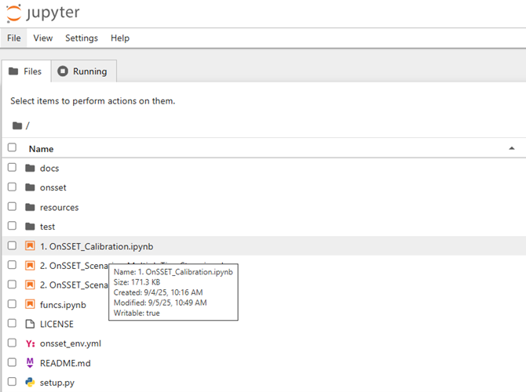
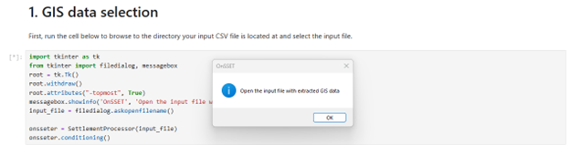
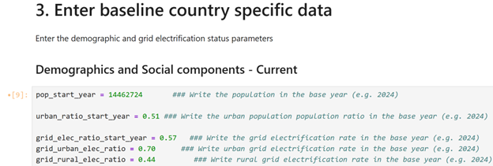
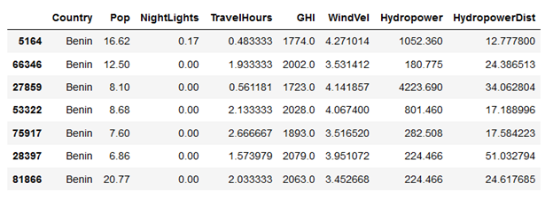
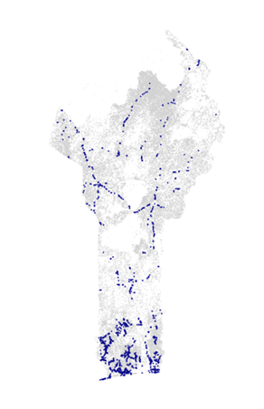

Calibrating the csv-file
===============================================

After extracting the GIS-data to a csv-file, it is time to *calibrate* the CSV-file. This has two main purposes:
  1. To ensure the population in the settlements match the official statistics
  2. To identify which settlements are likely electrified already.

The calibration is done using a Jupyter Notebook found among the `main OnSSET codes <https://github.com/OnSSET/onsset>`_

To launch the Jupyter Notebook, open **Anaconda Prompt** and run:

.. code-block:: bash

   cd PATH
   conda activate onsset_env
   jupyter notebook

Replace ``PATH`` with the location where you downloaded and extracted the
main **OnSSET** code.

First, open the 1. OnSSET_Calibration notebook:

This notebook calibrates the CSV file created in the previous exercise.

Run all cells from **top to bottom**.

Step 1 – GIS Data Selection
---------------------------

Select the file created in the previous exercise:

Step 2 – Start Year
-------------------

Enter the start year of your analysis. This is typically the latest year that you have data from, e.g. 2025.

Step 3 – Enter Baseline Country Data
------------------------------------

Update the demographic and electrification parameters for your country or region of interest:

Step 4 – Calibration of Start-Year Values
-----------------------------------------

Run the first cell in Step 4.

This step:

* Calibrates the population
* Generates additional information based on the GIS data

If successful, a preview table of the GIS data will appear.

Electrification Identification
^^^^^^^^^^^^^^^^^^^^^^^^^^^^^^

Based on the input data in the previous steps, in the next cell the code now creates some additional layers that are
useful for the electrification analysis. This can be an iterative process which requires calibration from the user.
One of the most important steps in the electrification analysis is the identification of the currently electrified settlements. Based on their location, the model then decides how easy it is to extend the grid to neighboring cells, or rather choose an off-grid technology.
The model calibrates which settlements are likely to be electrified in the start year, to match the national statistical
values defined above. A settlement is considered to be electrified if it meets all of the following conditions:
  *	Has more night-time lights than the defined threshold (this is set to 0 by default).
  *	Is closer to the existing grid network than the distance limit.
  *	Has more population than the threshold.

In the next cells, adjust the input thresholds and run all the cells to calibrate the population to
match the official statistics and identify which settlements are likely electrified already. You should see a map of
electrified settlements in blue at the end of this section.

   Example output showing electrified settlements.

.. note::

   In case you get an error at any point, commonly this is because you have not clicked Run on all cells after updating
   the input values, or the input values are not in the correct format (e.g. using a comma instead of a dot for decimals)

Step 5 – Exporting the Calibrated File
--------------------------------------

In the final cell, a pop-up window will ask where to save the calibrated file.

After saving the file, you are ready to run a scenario.