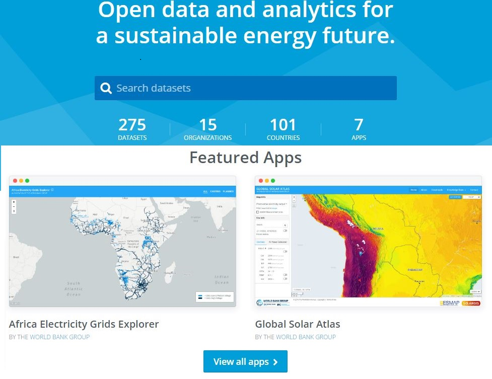

GIS data acquisition
============================

Geographic Information Systems
******************************

A Geographic Information System (GIS) is an integrated set of hardware and software tools,  designed to capture, store, manipulate, analyse, manage, and digitally present spatial (or geographic) data and related attribute information. GIS can relate information from different sources, using two key index variables space (or location) and time. Common GIS data types (models) include:

**Spatial Data:** Describe the absolute and relative location of geographic features.

    * Vectors

        - Arcs (Polylines): Line segments forming individual linear features
        - Polygons: Areas enclosed by arcs
        - Points: Single coordinate pairs

        .. image:: img/vector.png
            :width: 200px
            :height: 120px
            :align: center

    * Rasters

        - Grid-Cells: single column/row positions
        - Cell size: Resolution or else the accuracy of the data

        .. image:: img/raster.png
            :width: 200px
            :height: 120px
            :align: center

**Attribute data:** Describe characteristics of the spatial features. These characteristics can be quantitative and/or qualitative in nature.
Attribute data is often referred to as tabular data.

The selection of a particular data model, vector or raster, is dependent on the source and type of data, as well as the intended use of the data.
Certain analytical procedures require raster data while others are better suited to vector data.

GIS data sources
*****************

EnergyData.info
++++++++++++++++

Every day governments, private sector and development aid organizations collect data to inform, prepare and implement policies and investments.
Yet, while elaborate reports are made public, the data underpinning the analysis remain locked in a computer out of reach.
Because of this, the tremendous value they could bring to public and private actors in data-poor environments is too often lost.

`Energydata.info <https://energydata.info>`_ is an open data platform launched recently by The World Bank Group and several partners, trying to change energy data paucity.
It has been developed as a public good available to governments, development organizations, non-governmental organizations, academia,
civil society and individuals to share data and analytics that can help achieving universal access to modern energy services.
The database considers a variety of open, geospatial datasets of various context and granularity.
**KTH Division of Energy Systems Analysis** contributes on a contnuous basis by providing relevant datasets for electrification planning.

Indicative open libraries of GIS data
++++++++++++++++++++++++++++++++++++++

Over the past few years, KTH dESA has been actively involved in the field of geospatial analysis.
The following table presents a list of libraries and directories that provide access to open GIS data.

+----------------------------+---------------------+-------------------------------------------------------------------------------------------------------------------------------------------+
| Source                     | Type                | Link                                                                                                                                      |
+============================+=====================+===========================================================================================================================================+
| Penn                       | World per region    | http://guides.library.upenn.edu/content.php?pid=324392&sid=2655131                                                                        |
+----------------------------+---------------------+-------------------------------------------------------------------------------------------------------------------------------------------+
| MIT                        | World per region    | http://libguides.mit.edu/c.php?g=176295&p=1161383                                                                                         |
+----------------------------+---------------------+-------------------------------------------------------------------------------------------------------------------------------------------+
| EDEnextdata                | World per region    | https://www.edenextdata.com/?q=content/global-gis-datasets-links-0#Population%20Infrastructure%20Topography%20and%20Administration%20Data |
+----------------------------+---------------------+-------------------------------------------------------------------------------------------------------------------------------------------+
| Stanford                   | World per region    | https://lib.stanford.edu/GIS/data                                                                                                         |
+----------------------------+---------------------+-------------------------------------------------------------------------------------------------------------------------------------------+
| GIS Lounge                 | Finding GIS data    | http://www.gislounge.com/data-and-gis-resources/                                                                                          |
+----------------------------+---------------------+-------------------------------------------------------------------------------------------------------------------------------------------+
| dragons8mycat              | Different countries | https://dragons8mycat.wordpress.com/gis-data-sources/                                                                                     |
+----------------------------+---------------------+-------------------------------------------------------------------------------------------------------------------------------------------+
| rtwilson                   | Different types     | http://freegisdata.rtwilson.com/                                                                                                          |
+----------------------------+---------------------+-------------------------------------------------------------------------------------------------------------------------------------------+
| Planet OSM                 | Different types     | http://planet.osm.org/                                                                                                                    |
+----------------------------+---------------------+-------------------------------------------------------------------------------------------------------------------------------------------+
| Berkeley                   | Different types     | http://gif.berkeley.edu/resources/data_subject.html                                                                                       |
+----------------------------+---------------------+-------------------------------------------------------------------------------------------------------------------------------------------+
| Kings College              | Different types     | http://www.policysupport.org/waterworld                                                                                                   |
+----------------------------+---------------------+-------------------------------------------------------------------------------------------------------------------------------------------+
| CSRC                       | Different types     | http://rslab.sr.unh.edu/gdatalinks.html                                                                                                   |
+----------------------------+---------------------+-------------------------------------------------------------------------------------------------------------------------------------------+
| Data Discovery Center      | Different types     | http://ddc.unh.edu/                                                                                                                       |
+----------------------------+---------------------+-------------------------------------------------------------------------------------------------------------------------------------------+
| Spatial Hydrology          | Different types     | http://www.spatialhydrology.com/datawarehouse.html                                                                                        |
+----------------------------+---------------------+-------------------------------------------------------------------------------------------------------------------------------------------+
| Africa Information Highway | Different types     | http://dataportal.opendataforafrica.org/                                                                                                  |
+----------------------------+---------------------+-------------------------------------------------------------------------------------------------------------------------------------------+

Country specific databases
+++++++++++++++++++++++++++

With geospatial analysis gaining momentun in many research areas, many countries have set up their own geo-databases
in an effort to facilitate interdisciplinary research activities under a geospatial context. Here are few examples:

+----------------------+------------------------------------------------------------------------------------+
| Country              | Source                                                                             |
+======================+====================================================================================+
| Bolivia              | http://geo.gob.bo/#viewer                                                          |
+----------------------+------------------------------------------------------------------------------------+
| Brazil               | http://www.ibge.gov.br/english/geociencias/default_prod.shtm#REC_NAT               |
+----------------------+------------------------------------------------------------------------------------+
| East Timor           | http://goleaddog.com/gis-map/asia/timor-leste/                                     |
+----------------------+------------------------------------------------------------------------------------+
| Malawi               | http://www.masdap.mw/                                                              |
+----------------------+------------------------------------------------------------------------------------+
| Namibia              | http://www.uni-koeln.de/sfb389/e/e1/download/atlas_namibia/main_namibia_atlas.html |
+----------------------+------------------------------------------------------------------------------------+
| Nepal                | http://geoportal.icimod.org/                                                       |
+----------------------+------------------------------------------------------------------------------------+
| Russia               | http://gis-lab.info/qa/vmap0-eng.html                                              |
+----------------------+------------------------------------------------------------------------------------+

GIS data in OnSSET
*******************

OnSSET is a GIS-based tool and therefore requires data in a geographical format.
In the context of the power sector, necessary data includes those on current and planned infrastructure
(electric grid networks, road networks, power plants, industry, public facilities), population characteristics (distribution, location),
economic and industrial activity, and local renewable energy flows. The table below lists all layers required for an OnSSET analysis.

+----+---------------------------+-----------------+---------------------------------------------------------------------------------+
| #  | Dataset                   | Type            | Description                                                                     |
+====+===========================+=================+=================================================================================+
| 1  | Population density &      | Raster          | Spatial identification and                                                      |
|    | distribution              |                 | quantification of the current (base year) population. This dataset sets the     |
|    |                           |                 | basis of the ONSSET analysis as it is directly connected with the electricity   |
|    |                           |                 | demand and the assignment of energy access goals.                               |
+----+---------------------------+-----------------+---------------------------------------------------------------------------------+
| 2  | Administrative boundaries | Polygon         | Delineates the boundaries of the analysis.                                      |
|    |                           |                 |                                                                                 |
|    |                           |                 |                                                                                 |
+----+---------------------------+-----------------+---------------------------------------------------------------------------------+
| 3  | Existing grid network     | Line shapefile  | Used to identify and spatially calibrate the currently                          |
|    |                           |                 | electrified/non-electrified population.                                         |
|    |                           |                 |                                                                                 |
+----+---------------------------+-----------------+---------------------------------------------------------------------------------+
| 4  | Substations               | Point shapefile | Current Substation infrastructure used to identify                              |
|    |                           |                 | and spatially calibrate the currently electrified/non-electrified               |
|    |                           |                 | population. It is also used in order to specify grid extension suitability.     |
|    |                           |                 |                                                                                 |
+----+---------------------------+-----------------+---------------------------------------------------------------------------------+
| 5  | Roads                     | Line shapefile  | Current Road infrastructure                                                     |
|    |                           |                 | used                                                                            |
|    |                           |                 | to,identify and spatially calibrate the                                         |
|    |                           |                 | currently electrified/non-electrified population. It is also used in order to   |
|    |                           |                 | specify grid extension suitability.                                             |
|    |                           |                 |                                                                                 |
+----+---------------------------+-----------------+---------------------------------------------------------------------------------+
| 6  | Planned grid network      | Point shapefile | Represents the future plans for the                                             |
|    |                           |                 | extension of the national electric grid. It also includes extension to          |
|    |                           |                 | current/future substations, power plants, mines and queries.                    |
|    |                           |                 |                                                                                 |
+----+---------------------------+-----------------+---------------------------------------------------------------------------------+
| 7  | Nighttime lights          | Raster          | Dataset used to,identify and spatially calibrate the                            |
|    |                           |                 | currently electrified/non-electrified population.                               |
|    |                           |                 |                                                                                 |
+----+---------------------------+-----------------+---------------------------------------------------------------------------------+
| 8  | GHI                       | Raster          | Provide information                                                             |
|    |                           |                 | about                                                                           |
|    |                           |                 | the Global Horizontal Irradiation (kWh/m2/year)                                 |
|    |                           |                 | over an area. This is later used to identify the availability/suitability of    |
|    |                           |                 | Photovoltaic systems.                                                           |
|    |                           |                 |                                                                                 |
+----+---------------------------+-----------------+---------------------------------------------------------------------------------+
| 9  | Wind speed                | Raster          | Provide information                                                             |
|    |                           |                 | about                                                                           |
|    |                           |                 | the wind velocity (m/sec) over an area. This is later used to identify the      |
|    |                           |                 | availability/suitability of wind power (using Capacity factors).                |
|    |                           |                 |                                                                                 |
+----+---------------------------+-----------------+---------------------------------------------------------------------------------+
| 10 | Hydro power potential     | Point shapefile | Points showing potential mini/small                                             |
|    |                           |                 | hydropower potential. Dataset developed by KTH dESA                             |
|    |                           |                 | including environmental, social and topological restrictions                    |
|    |                           |                 | and provides                                                                    |
|    |                           |                 | power availability in each identified point. Other sources can be used but      |
|    |                           |                 | should also provide such information to reassure the proper model function.     |
|    |                           |                 |                                                                                 |
+----+---------------------------+-----------------+---------------------------------------------------------------------------------+
| 11 | Travel time               | Raster          | Visualizes spatially the travel                                                 |
|    |                           |                 | time required to reach from any individual cell to the closest town with        |
|    |                           |                 | population more than 50,000 people.                                             |
|    |                           |                 |                                                                                 |
+----+---------------------------+-----------------+---------------------------------------------------------------------------------+
| 12 | Elevation Map             | Raster          | Filled DEM maps are use in a number                                             |
|    |                           |                 | of processes                                                                    |
|    |                           |                 | in                                                                              |
|    |                           |                 | the analysis (Energy potentials, restriction zones, grid extension suitability  |
|    |                           |                 | map etc.).                                                                      |
|    |                           |                 |                                                                                 |
+----+---------------------------+-----------------+---------------------------------------------------------------------------------+
| 13 | Slope                     | Raster          | A sub product of DEM, used in                                                   |
|    |                           |                 | forming restriction zones and to specify grid extension suitability.            |
|    |                           |                 |                                                                                 |
+----+---------------------------+-----------------+---------------------------------------------------------------------------------+
| 14 | Land Cover                | Raster          | Land cover maps are use in a number                                             |
|    |                           |                 | of processes                                                                    |
|    |                           |                 | in                                                                              |
|    |                           |                 | the analysis (Energy potentials, restriction zones, grid extension suitability  |
|    |                           |                 | map etc.).                                                                      |
|    |                           |                 |                                                                                 |
+----+---------------------------+-----------------+---------------------------------------------------------------------------------+
| 15 | Solar Restriction         | Raster          | Solar Restriction maps are used in                                              |
|    |                           |                 | order to determine areas in which the use of PV-technologies is prohibited      |
+----+---------------------------+-----------------+---------------------------------------------------------------------------------+

.. note::

   * Before a model can be built, one must acquire the layers of data outlined above.
   More often than not, each layer must be acquired on its own.
   The final outcome is a multilayer map conveying all the information necessary
   to initiate an OnSSET electrification analysis.

   * The spatial resolution of the final map depends on the availability of input data and on the targeted level of accuracy.
   OnSSET can handle various levels of input data, with typical resolutions ranging from 1x1 kilometers (km) to 10x10 km.
   The selection of inputs usually involves a trade-off between the time needed for computation and the desired level of detail.
   The modeler has to decide which resolution best fits the purpose of the analysis.

GIS basic datasets
+++++++++++++++++++

Administrative boundaries
--------------------------------

+-----------------------+-----------------------+------------------------------------------------------------------------------------------------------------------------------------------------------------------+------+-------------+------------------------------------------------------------------------------------------------------+
|        Coverage       |          Type         |                                                                            Resolution                                                                            | Year |    Source   |                                                 Link                                                 |
+=======================+=======================+==================================================================================================================================================================+======+=============+======================================================================================================+
|         World         |       shapefile       |       Counties,provinces, departments, bibhag, bundeslander, daerah istimewa, fivondronana,,krong, landsvæðun, opština, sous-préfectures, counties & thana       | 2011 |     GADM    |                                      https://gadm.org/                                       |
+-----------------------+-----------------------+------------------------------------------------------------------------------------------------------------------------------------------------------------------+------+-------------+------------------------------------------------------------------------------------------------------+
| World,(& per country) |       shapefile       |                                                                             Countries                                                                            | 2011 |   DIVA-GIS  |                                     http://www.diva-gis.org/Data                                     |
+-----------------------+-----------------------+------------------------------------------------------------------------------------------------------------------------------------------------------------------+------+-------------+------------------------------------------------------------------------------------------------------+
|         Europe        | geodatabase/shapefile |                                                                       Countries, provinces                                                                       | 2013 |   Eurostat  | http://ec.europa.eu/eurostat/web/gisco/geodata/reference-data/administrative-units-statistical-units |
+-----------------------+-----------------------+------------------------------------------------------------------------------------------------------------------------------------------------------------------+------+-------------+------------------------------------------------------------------------------------------------------+

Population data
----------------

+-----------------------------------------------+--------------------------+---------------------------+------------------------+------------+-----------------------------------------------------------------------------------+
| Coverage                                      | Type                     | Resolution                | Year                   | Source     | Link                                                                              |
+===============================================+==========================+===========================+========================+============+===================================================================================+
| Africa, Asia, America                         | Raster                   | 100 m grid cells          | (depending on country) | Worldpop   | http://www.worldpop.org.uk/data/data_sources/                                     |
+-----------------------------------------------+--------------------------+---------------------------+------------------------+------------+-----------------------------------------------------------------------------------+
| World                                         | grid                     | 2.5 arc-minute grid cells | 90/95/00               | SEDAC      | http://sedac.ciesin.columbia.edu/data/set/gpw-v3-population-density/data-download |
+-----------------------------------------------+--------------------------+---------------------------+------------------------+------------+-----------------------------------------------------------------------------------+
| World                                         | shapefile, raster (grid) | 2.5 arc-minute grid cells | 2000                   | UNEP       | http://geodata.grid.unep.ch/results.php                                           |
+-----------------------------------------------+--------------------------+---------------------------+------------------------+------------+-----------------------------------------------------------------------------------+
| Europe                                        | shapefile, csv           | 1 km grid cells           | 2006, 2011             | GEOSTAT    | http://ec.europa.eu/eurostat/c/portal/layout?p_l_id=6033090&p_v_l_s_g_id=0        |
+-----------------------------------------------+--------------------------+---------------------------+------------------------+------------+-----------------------------------------------------------------------------------+
| Ghana, Haiti, Malawi, South Africa, Sri Lanka | raster (grid)            | 1 arc-second              | 2015                   | CIESIN     | https://ciesin.columbia.edu/data/hrsl/                                            |
+-----------------------------------------------+--------------------------+---------------------------+------------------------+------------+-----------------------------------------------------------------------------------+
| World                                         | Various                  | Various                   | 2016                   | dhsprogram | http://spatialdata.dhsprogram.com/home/                                           |
+-----------------------------------------------+--------------------------+---------------------------+------------------------+------------+-----------------------------------------------------------------------------------+

Transmission lines data
----------------------------

+----------------------+-------------------+-------------------------------------------------------------+------+---------------------------+-----------------------------------------------------------------------------------------------+
| UK                   | shapefile         | Power transmission lines, underground cables, stations etc. | na   | National Grid             | http://www2.nationalgrid.com/uk/services/land-and-development/planning-authority/shape-files/ |
+----------------------+-------------------+-------------------------------------------------------------+------+---------------------------+-----------------------------------------------------------------------------------------------+
| US                   | raster            | 100 m grid cells                                            | 2015 | ArcGIS online             | http://www.arcgis.com/home/item.html?id=918e6d9b1cc84d15ba13e911d18a0c5e                      |
+----------------------+-------------------+-------------------------------------------------------------+------+---------------------------+-----------------------------------------------------------------------------------------------+
| World                | OSM potential     | points or polylines                                         | 2015 | OSM of various mirrors    |                                                                                               |
+----------------------+-------------------+-------------------------------------------------------------+------+---------------------------+-----------------------------------------------------------------------------------------------+
| World                | From Vmap level 0 | Power lines and utilities                                   | na   | Can be downloaded from:   | http://gis-lab.info/qa/vmap0-eng.html                                                         |
+----------------------+-------------------+-------------------------------------------------------------+------+---------------------------+-----------------------------------------------------------------------------------------------+

Power plants location data
----------------------------

+----------------------+----------------------+------------------------------------+--------------------+--------------+----------------------------------------------------------------------------------------+
| Coverage             | Type                 | Resolution                         | Year               | Source       | Link                                                                                   |
+======================+======================+====================================+====================+==============+========================================================================================+
| World                | shapefile (4 levels) | Generators, substations,masts      | 2009               | Vmap level 0 | http://gis-lab.info/qa/vmap0-eng.html                                                  |
+----------------------+----------------------+------------------------------------+--------------------+--------------+----------------------------------------------------------------------------------------+
| World                | shapefile            | Generators (power source included) | 2015               | Geofabrik    | Available from KTH-dESA upon request                                                   |
+----------------------+----------------------+------------------------------------+--------------------+--------------+----------------------------------------------------------------------------------------+

Elevation
--------------

+-----------------------+------------------+-------------------------------------+------------+----------------------------+---------------------------------------------------------------------------------+
| Coverage              | Type             | Resolution                          | Year       | Source                     | Link                                                                            |
+=======================+==================+=====================================+============+============================+=================================================================================+
| World                 | geoTIFF          | 30 m spatial resolution             | 2009       | METI Japan, NASA           | http://www.jspacesystems.or.jp/ersdac/GDEM/E/2.html                             |
+-----------------------+------------------+-------------------------------------+------------+----------------------------+---------------------------------------------------------------------------------+
| World                 | geoTIFF          | 30 m posting, 1x1 degree tiles      | 2009, 2011 | METI Japan, NASA           | http://asterweb.jpl.nasa.gov/gdem.asp                                           |
+-----------------------+------------------+-------------------------------------+------------+----------------------------+---------------------------------------------------------------------------------+
| World                 | ASCII, GeoTIFF   | 3 arc sec (approx. 90 m resolution) | 2003       | CGIAR CSI                  | http://www.cgiar-csi.org/data/srtm-90m-digital-elevation-database-v4-1#download |
+-----------------------+------------------+-------------------------------------+------------+----------------------------+---------------------------------------------------------------------------------+
| Different countries   | GeoTIFF          | 1 to 30 arc sec                     | 2014       | Global Land Cover Facility | http://www.glcf.umd.edu/data/glsdem/description.shtml                           |
+-----------------------+------------------+-------------------------------------+------------+----------------------------+---------------------------------------------------------------------------------+
| Different DEM sources | various          | various                             | various    | GIS 4 Geomorphology        | http://gis4geomorphology.com/dem-data-sources/                                  |
+-----------------------+------------------+-------------------------------------+------------+----------------------------+---------------------------------------------------------------------------------+
| World                 | .bil and/or .tif | 15 arcseconds/30arcseconds          | various    | ISCGM                      | https://www.iscgm.org/gmd/                                                      |
+-----------------------+------------------+-------------------------------------+------------+----------------------------+---------------------------------------------------------------------------------+
| World                 | GeoTIFF          | 16 arcseconds/30arcseconds          | various    | NOOA                       | http://www.ngdc.noaa.gov/mgg/topo/gltiles.html                                  |
+-----------------------+------------------+-------------------------------------+------------+----------------------------+---------------------------------------------------------------------------------+
| World                 | GeoTIFF          | 17 arcseconds/30arcseconds          | various    | DGADV                      | http://www.dgadv.com/dowdem/                                                    |
+-----------------------+------------------+-------------------------------------+------------+----------------------------+---------------------------------------------------------------------------------+
| World + Arctic areas  | GeoTIFF          | 30 arcseconds                       | various    | WebGIS                     | http://www.webgis.com/terr_world.html                                           |
+-----------------------+------------------+-------------------------------------+------------+----------------------------+---------------------------------------------------------------------------------+

Travel time to major cities
----------------------------

+----------------------+---------------------------------+------------+-----------------------+--------------------------+----------------------------------------------------------+
| Coverage             | Type                            | Resolution | Year                  | Source                   | Link                                                     |
+======================+=================================+============+=======================+==========================+==========================================================+
| World                | ESRI grid                       | 30 arc sec | 2008 (data from 2000) | Joint Research Center EU | http://forobs.jrc.ec.europa.eu/products/gam/download.php |
+----------------------+---------------------------------+------------+-----------------------+--------------------------+----------------------------------------------------------+
| Africa (sub-Saharan) | csv, ESRI ASCII raster, GeoTIFF | 5 arc sec  | 2010                  | Harvest Choice           | http://harvestchoice.org/data/tt_port                    |
+----------------------+---------------------------------+------------+-----------------------+--------------------------+----------------------------------------------------------+
| World                | Raster, GeoTIFF                 | 5 arc sec  | 2015                  | Univeristy of Oxford     | https://map.ox.ac.uk/explorer/#/explorer                 |
+----------------------+---------------------------------+------------+-----------------------+--------------------------+----------------------------------------------------------+

Mining and Quarrying
----------------------------

+----------+----------------------------------------------------+-------------------------------------------+------+--------+-------------------------------------------------------------------------------------------------------------------------------------------------------+
| Coverage | Type                                               | Resolution                                | Year | Source | Link                                                                                                                                                  |
+==========+====================================================+===========================================+======+========+=======================================================================================================================================================+
| USA      | Shapefile, csv, KML, KMZ                           | Active mines and mineral plants in the US | 2003 | USGS   | http://mrdata.usgs.gov/mineplant/                                                                                                                     |
+----------+----------------------------------------------------+-------------------------------------------+------+--------+-------------------------------------------------------------------------------------------------------------------------------------------------------+
| World    | Shapefile, dBase, HTML, Tab text,csv, Google earth | points                                    | 2012-2013     | http://minerals.usgs.gov/minerals/pubs/country/?utm_source=feedburner&utm_medium=feed&utm_campaign=Feed%3A+usgs_mpubs+%28USGS+Minerals+Periodicals%29 |
+          +                                                    +                                           +               +-------------------------------------------------------------------------------------------------------------------------------------------------------+
|          |                                                    |                                           |               | http://mrdata.usgs.gov/mineral-resources/minfac.html                                                                                                  |
+          +                                                    +                                           +               +-------------------------------------------------------------------------------------------------------------------------------------------------------+
|          |                                                    |                                           |               | http://mrdata.usgs.gov/mineral-operations/                                                                                                            |
+----------+----------------------------------------------------+-------------------------------------------+---------------+-------------------------------------------------------------------------------------------------------------------------------------------------------+

Land cover
--------------

+-----------------------+----------------------------------------------------------------------------------------------+-------------------------+-------------------------------+----------------------------+--------------------------------------------------------------------------------+
| Coverage              | Type                                                                                         | Resolution              | Year                          | Source                     | Link                                                                           |
+=======================+==============================================================================================+=========================+===============================+============================+================================================================================+
| World                 | Bioenergy potential                                                                          | 1 km                    | na                            | IRENA                      | http://irena.masdar.ac.ae/bioenergy/                                           |
+-----------------------+----------------------------------------------------------------------------------------------+-------------------------+-------------------------------+----------------------------+--------------------------------------------------------------------------------+
| World                 | CI Land cover - raster                                                                       | 300 m                   | time series from 1992 to 2015 | ESA                        | http://maps.elie.ucl.ac.be/CCI/viewer/                                         |
+-----------------------+----------------------------------------------------------------------------------------------+-------------------------+-------------------------------+----------------------------+--------------------------------------------------------------------------------+
| World                 | GeoTiff, Google earth, jpeg,png                                                              | 1-0.1 degrees           | 2001-2010                     | NASA-NEO                   | http://neo.sci.gsfc.nasa.gov/view.php?datasetId=MCD12C1_T1                     |
+-----------------------+----------------------------------------------------------------------------------------------+-------------------------+-------------------------------+----------------------------+--------------------------------------------------------------------------------+
| World                 | HDF-EOS                                                                                      | 0.5 degrees             | 2001-2012                     | NASA-MODIS                 | https://lpdaac.usgs.gov/dataset_discovery/modis/modis_products_table/mcd12c1   |
+-----------------------+----------------------------------------------------------------------------------------------+-------------------------+-------------------------------+----------------------------+--------------------------------------------------------------------------------+
| World                 | Raster, csv                                                                                  | 0.0028 - 0.0083 degrees | 2000, 2005, 2010              | ESA-ENVISAT                | http://maps.elie.ucl.ac.be/CCI/viewer/index.php                                |
+-----------------------+----------------------------------------------------------------------------------------------+-------------------------+-------------------------------+----------------------------+--------------------------------------------------------------------------------+
| World/Protected areas | Shapefile, KML, csv                                                                          | na                      | 2014                          | Protected planet           | http://www.protectedplanet.net/                                                |
+-----------------------+----------------------------------------------------------------------------------------------+-------------------------+-------------------------------+----------------------------+--------------------------------------------------------------------------------+
| World                 | various                                                                                      | various                 | 2015                          | Global Land Cover Facility | http://landcover.org/data/                                                     |
+-----------------------+----------------------------------------------------------------------------------------------+-------------------------+-------------------------------+----------------------------+--------------------------------------------------------------------------------+
| World                 | Rasters for: Costal areas, Cultivated areas, Forests, Mountains, Islands, Inland waters etc. | 0.00833 degrees         | 2000                          | SEDAC                      | http://sedac.ciesin.columbia.edu/data/set/ma-ecosystems/data-download          |
+-----------------------+----------------------------------------------------------------------------------------------+-------------------------+-------------------------------+----------------------------+--------------------------------------------------------------------------------+
| World                 | Raster for croplands                                                                         | 0.0833 degrees          | 2000                          | SEDAC                      | http://sedac.ciesin.columbia.edu/data/set/aglands-croplands-2000/data-download |
+-----------------------+----------------------------------------------------------------------------------------------+-------------------------+-------------------------------+----------------------------+--------------------------------------------------------------------------------+
| World                 | Various Rasters on Land Use                                                                  | various                 | 1990-2010                     | Nelson Institute           | http://nelson.wisc.edu/sage/data-and-models/datasets.php                       |
+-----------------------+----------------------------------------------------------------------------------------------+-------------------------+-------------------------------+----------------------------+--------------------------------------------------------------------------------+
| World                 | Soil type                                                                                    | various                 | na                            | Worldmap.Harvard           | https://worldmap.harvard.edu/data/geonode:DSMW_RdY                             |
+-----------------------+----------------------------------------------------------------------------------------------+-------------------------+-------------------------------+----------------------------+--------------------------------------------------------------------------------+
| World                 | Various Rasters on Land Use                                                                  | various                 | 1980-2014                     | EarthStat                  | http://www.earthstat.org/data-download/                                        |
+-----------------------+----------------------------------------------------------------------------------------------+-------------------------+-------------------------------+----------------------------+--------------------------------------------------------------------------------+

The model classifies the land cover in order to calculate the grid extension penalties. The default classification values
are based on the MODIS dataset found `here <http://glcf.umd.edu/data/lc/>`_, where the legend ranges from 0-16 with the values and corresponding land
cover type can be seen below. If land cover data is retrieved from other data sources with different classification
values they should be reclassified in GIS (using the Reclassify tool in ArcGIS or r.reclass in QGIS) to match those below. Alternatively changes can be madein the Python code instead. If this reclassification is not performed it may lead to an incorrect grid penalty factor or, if the highest values are above 16, an error message while running the code.

+-------+------------------------------------+
| Value | Label                              |
+-------+------------------------------------+
| 0     | Water                              |
+-------+------------------------------------+
| 1     | Evergreen Needleleaf forest        |
+-------+------------------------------------+
| 2     | Evergreen Broadleaf forest         |
+-------+------------------------------------+
| 3     | Deciduous Needleleaf forest        |
+-------+------------------------------------+
| 4     | Deciduous Broadleaf forest         |
+-------+------------------------------------+
| 5     | Mixed forest                       |
+-------+------------------------------------+
| 6     | Closed shrublands                  |
+-------+------------------------------------+
| 7     | Open shrublands                    |
+-------+------------------------------------+
| 8     | Woody savannas                     |
+-------+------------------------------------+
| 9     | Savannas                           |
+-------+------------------------------------+
| 10    | Grasslands                         |
+-------+------------------------------------+
| 11    | Permanent wetlands                 |
+-------+------------------------------------+
| 12    | Croplands                          |
+-------+------------------------------------+
| 13    | Urban and built-up                 |
+-------+------------------------------------+
| 14    | Cropland/Natural vegetation mosaic |
+-------+------------------------------------+
| 15    | Snow and ice                       |
+-------+------------------------------------+
| 16    | Barren or sparsely vegetated       |
+-------+------------------------------------+

Others
--------------

+---------------------------------+------------------------------+---------------------------------------------------------------------+------------+--------------------------------+--------------------------------------------------------------+
| Coverage                        | Type                         | Resolution                                                          | Year       | Source                         | Link                                                         |
+=================================+==============================+=====================================================================+============+================================+==============================================================+
| World                           | Coast Lines, oceans          | Physical vectors, ESRI shapefiles, GeoTIFF (1:10, 1:50 and 1:110 m) | 2015       | Natural Earth                  | http://www.naturalearthdata.com/downloads/                   |
+---------------------------------+------------------------------+---------------------------------------------------------------------+------------+--------------------------------+--------------------------------------------------------------+
| World                           | Climate data                 | 30 arc seconds and 2.5/5/10 arc minutes                             | na         | WorldClim                      | http://www.worldclim.org/                                    |
+---------------------------------+------------------------------+---------------------------------------------------------------------+------------+--------------------------------+--------------------------------------------------------------+
| World/USA                       | Climate change scenarios     | various                                                             | na         | na                             | https://gisclimatechange.ucar.edu/                           |
+---------------------------------+------------------------------+---------------------------------------------------------------------+------------+--------------------------------+--------------------------------------------------------------+
| World/Australia                 | Water and Landscape Dynamics | 0.05 to 1 degrees                                                   | 1979-2012  | Australian National University | http://www.wenfo.org/wald/data-software/                     |
+---------------------------------+------------------------------+---------------------------------------------------------------------+------------+--------------------------------+--------------------------------------------------------------+
| Open Street Map (OSM) - Osmosis | osm.pbf                      | depending on mirror source                                          | up to date | NOAA                           | http://ngdc.noaa.gov/eog/dmsp/downloadV4composites.html      |
+---------------------------------+------------------------------+---------------------------------------------------------------------+------------+--------------------------------+--------------------------------------------------------------+
| Nighttime lights                | Raster file                  | 0.0083 degrees                                                      | 1992-2013  | na                             | https://www.ngdc.noaa.gov/eog/dmsp/downloadV4composites.html |
+---------------------------------+------------------------------+---------------------------------------------------------------------+------------+--------------------------------+--------------------------------------------------------------+
| Africa information Highway      | various                      | vectors                                                             | various    | AfDB                           | http://dataportal.opendataforafrica.org/                     |
+---------------------------------+------------------------------+---------------------------------------------------------------------+------------+--------------------------------+--------------------------------------------------------------+
| World                           | Cliamte data                 | various                                                             | various    | Oregon State University        | http://globalclimatedata.org/                                |
+---------------------------------+------------------------------+---------------------------------------------------------------------+------------+--------------------------------+--------------------------------------------------------------+

Methodology for Open Street Map data and Osmosis
--------------------------------------------------------

.. note::

    * Open Street Map (OSM) is a collaborative project that intends to provide free and open access data used in mapping the world. This document aims at describing in brief the methodology used in order to obtain OSM data and transform them in compatible and useful information with the use of Osmosis and QGIS.

    * To begin with, bulk download of updated OSM data can be performed through the Planet OSM: http://planet.osm.org/.

    * The files can be downloaded as .xml and .pbf format. However, due to the large volume of data there are various mirrors/extracts that provide access to masked data for different regions of the planet. More information can be found here: http://wiki.openstreetmap.org/wiki/Planet.osm#Downloading. In previous cases Geofabrik.de and bbbike.org where used successfully.

    * It should be mentioned at this point that an interesting tool is the Overpass API. More specifically, using quarry and convert forms and redirecting to Overpass Turbo it is possible to utilize the wizard function and obtain required data for a defined area. The area is delineated by the map shown in the screen while data types include nodes, ways and relations. The data can be exported in various formats with .kml (amongst others) being compatible with the latest versions of QGIS. (As an example use the word: power in the wizard function and you will get the power related information depicted on the map). A disadvantage of this method is that the restrictions in the area size, which is limited to 100 square km.

    * Coming back to the other sources (Geofabrik, BBBike), data can be downloaded per region in .pbf format. In the latest version of QGIS it is possible to insert this data directly by simply dragging the file onto the QGIS window. However, since the files are usually very large it is recommended to transform the .pbf into a spatialite database.

    * To do this transformation open up the OSGeo shell follwoing with your installation, navigate to the folder in which you have your .pbf file (by typing cd [folder path]) and enter the following line: **ogr2ogr -f SQLite X.sqlite Y.pbf** (note change **X** to the name you want to use for your spatialite database and **Y** to the name of your downloaded .pbf file)

    * Once This transformation is finished (it may take some time) drag this new file into QGIS and work with it instead of the .pbf file.

    * OSM data provide access to a tremendous amount of information of various types. Feel free to explore the potential and share the results with an enthusiastic community.

Datasets that require further precessing
++++++++++++++++++++++++++++++++++++++++

Solar GHI
--------------

+----------------------------------+-----------------+-------------------------------+-----------+-----------+-----------------------------------------------------------------------------------------------------------------------------------+
| Coverage                         | Type            | Resolution                    | Year      | Source    | Link                                                                                                                              |
+==================================+=================+===========================================+===========+===================================================================================================================================+
| World                            | csv             | Local - Regional - World      | 1993-2006 | NASA      | https://eosweb.larc.nasa.gov/cgi-bin/sse/sse.cgi?skip@larc.nasa.gov+s01+s04+s06+s08+s11#s04                                       |
+----------------------------------+-----------------+-------------------------------+-----------+-----------+-----------------------------------------------------------------------------------------------------------------------------------+
| World                            | tiff            | Regional - country            | 2016      | Word Bank | http://www.globalsolaratlas.info                                                                                                  |
+----------------------------------+-----------------+-------------------------------+-----------+-----------+-----------------------------------------------------------------------------------------------------------------------------------+
| South America                    | shapefile, csv  | 40 km                         | 2015      | NREL      | https://catalog.data.gov/dataset/solar-monthly-and-annual-average-direct-normal-dni-global-horizontal-ghi-latitude-tilt-and-7a88f |
+----------------------------------+-----------------+-------------------------------+-----------+-----------+-----------------------------------------------------------------------------------------------------------------------------------+
| Europe                           | ESRI ascii grid | 1km                           | 1981-1990 | JRC       | http://re.jrc.ec.europa.eu/pvgis/download/solar_radiation_classic_laea_download.html                                              |
+----------------------------------+-----------------+-------------------------------+-----------+-----------+-----------------------------------------------------------------------------------------------------------------------------------+
| Europe and Africa                | ESRI ascii grid | 1.5 arc-minute                | 1998-2011 | JRC       | http://re.jrc.ec.europa.eu/pvgis/download/solar_radiation_cmsaf_download.html                                                     |
+----------------------------------+-----------------+-------------------------------+-----------+-----------+-----------------------------------------------------------------------------------------------------------------------------------+
| World (-66 to 66 both long, lat) | csv             | 0.2 gegrees (20km)            | 1985-2005 | SoDa      | http://www.soda-is.com/eng/helioclim/helioclim1_eng.html                                                                          |
+----------------------------------+-----------------+-------------------------------+-----------+-----------+-----------------------------------------------------------------------------------------------------------------------------------+
| Solar Radiation resources        | various types   | Various areas and resolutions |           |           | http://photovoltaic-software.com/solar-radiation-database.php                                                                     |
+----------------------------------+-----------------+-------------------------------+-----------+-----------+-----------------------------------------------------------------------------------------------------------------------------------+

Raster Preparation Methodology using NASA datasets
----------------------------------------------------

.. note::

Documentation on solar power assessment is available `here <https://github.com/OnSSET/OnSSET/tree/master/Resource_Assessment/Solar>`_.

Wind
---------

+-------------------------------------------------------------------------------------------------------------------------------------------------------------------------------------------+-----------+--------------------------------------+-----------+------------------+-----------------------------------------------------------------------------------------------------------------------------------+
| Coverage                                                                                                                                                                                  | Type      | Resolution                           | Year      | Source           | Link                                                                                                                              |
+===========================================================================================================================================================================================+===========+======================================+===========+==================+===================================================================================================================================+
| World                                                                                                                                                                                     | xls,csv   | 1 degree spatial resolution          | 1993-2006 | NASA             | https://eosweb.larc.nasa.gov/cgi-bin/sse/subset.cgi?email=skip@larc.nasa.gov                                                      |
+-------------------------------------------------------------------------------------------------------------------------------------------------------------------------------------------+-----------+--------------------------------------+-----------+------------------+-----------------------------------------------------------------------------------------------------------------------------------+
| World                                                                                                                                                                                     | xls, csv  | 0.5x0.667 degrees spatial resolution | 1979-2015 | EarthData - NASA | http://disc.sci.gsfc.nasa.gov/mdisc/additional/tools  http://disc.sci.gsfc.nasa.gov/daac-bin/FTPSubset.pl?LOOKUPID_List=MATMNXOCN |
+-------------------------------------------------------------------------------------------------------------------------------------------------------------------------------------------+-----------+--------------------------------------+-----------+------------------+-----------------------------------------------------------------------------------------------------------------------------------+
| World                                                                                                                                                                                     | na        | na                                   | na        | ADM-Aeolus ESA   | http://www.esa.int/Our_Activities/Observing_the_Earth/The_Living_Planet_Programme/Earth_Explorers/ADM-Aeolus/ESA_s_wind_mission   |
+-------------------------------------------------------------------------------------------------------------------------------------------------------------------------------------------+-----------+--------------------------------------+-----------+------------------+-----------------------------------------------------------------------------------------------------------------------------------+
| World                                                                                                                                                                                     | Raster    | 1x1 km spatial resolution            |           | IRENA            | https://irena.masdar.ac.ae/gallery/#map/103                                                                                       |
+-------------------------------------------------------------------------------------------------------------------------------------------------------------------------------------------+-----------+--------------------------------------+-----------+------------------+-----------------------------------------------------------------------------------------------------------------------------------+
| Afghanistan, Pakistan, Armenia, Bhutan, Central America, Chile, China, Cuba, Domenical Republic, Ghana, Indonesia, Mexico, Mongolia, Russia, Sri Lanka, United Arab Emirates, Philippines | shapefile | Wind speed 50m                       | 2009      | NREL             | http://www.nrel.gov/gis/data_international.html                                                                                   |
+-------------------------------------------------------------------------------------------------------------------------------------------------------------------------------------------+-----------+--------------------------------------+-----------+------------------+-----------------------------------------------------------------------------------------------------------------------------------+

Raster Preparation Methodology using NASA datsets
---------------------------------------------------

.. note::

Additional documentation on wind power assessment is available `here <https://github.com/OnSSET/OnSSET/tree/master/Resource_Assessment/Wind>`_.

Hydro
---------
+---------------+-------------------------------------------------------------------------------------------------+-----------------------------------------------------------------------------------------------------------------------------------------------------------------+-------------------------------------------------------------------------------------------------------+
|   Hydro data  |                                               Type                                              |                                                                              Link                                                                               |                                                Remarks                                                |
+===============+=================================================================================================+=================================================================================================================================================================+=======================================================================================================+
|  Vmap level 0 | World shapefiles                                                                                | https://www.lib.msu.edu/branches/map/findingaids/VMAP0                                                                                                          | No permission to access                                                                               |
+               +-------------------------------------------------------------------------------------------------+-----------------------------------------------------------------------------------------------------------------------------------------------------------------+-------------------------------------------------------------------------------------------------------+
|               | Shapefiles (4 levels)                                                                           | http://gis-lab.info/qa/vmap0-eng.html                                                                                                                           |                                                                                                       |
|               |                                                                                                 |                                                                                                                                                                 |                                                                                                       |
|               |                                                                                                 |                                                                                                                                                                 |                                                                                                       |
+               +-------------------------------------------------------------------------------------------------+-----------------------------------------------------------------------------------------------------------------------------------------------------------------+-------------------------------------------------------------------------------------------------------+
|               | World shapefiles                                                                                | http://geoengine.nima.mil/geospatial/SW_TOOLS/NIMAMUSE/webinter/rast_roam.html                                                                                  | page not displayed                                                                                    |
+---------------+-------------------------------------------------------------------------------------------------+-----------------------------------------------------------------------------------------------------------------------------------------------------------------+-------------------------------------------------------------------------------------------------------+
| GRDC          | database: River basins, watersheds and gauged stations                                          | http://www.bafg.de/GRDC/EN/02_srvcs/21_tmsrs/riverdischarge_node.html                                                                                           | Permission required for GIS layers                                                                    |
+---------------+-------------------------------------------------------------------------------------------------+-----------------------------------------------------------------------------------------------------------------------------------------------------------------+-------------------------------------------------------------------------------------------------------+
| HydroSHED     | Watersheds, River Networks etc.                                                                 | http://hydrosheds.cr.usgs.gov/index.php                                                                                                                         |                                                                                                       |
+---------------+-------------------------------------------------------------------------------------------------+-----------------------------------------------------------------------------------------------------------------------------------------------------------------+-------------------------------------------------------------------------------------------------------+
| USGS          | StreamStats (estimation of ungauged rivers)                                                     | http://water.usgs.gov/osw/streamstats/                                                                                                                          | Only for the US                                                                                       |
+---------------+-------------------------------------------------------------------------------------------------+-----------------------------------------------------------------------------------------------------------------------------------------------------------------+-------------------------------------------------------------------------------------------------------+
| ArcSWAT       | Hydrological model - calculates run-off for rivers                                              | http://swat.tamu.edu/software/arcswat/                                                                                                                          | Integrated with ArcGIS. Requires calibration with data from at least on gauged point of the river     |
+---------------+-------------------------------------------------------------------------------------------------+-----------------------------------------------------------------------------------------------------------------------------------------------------------------+-------------------------------------------------------------------------------------------------------+
| VAPIDRO-ASTE  | Calculates best available location for hydro, Developed in Visual basic, integrated with ArcGIS | http://www.seehydropower.eu/download_tools/details.php?id=2                                                                                                     | Requires                                                                                              |
|               |                                                                                                 |                                                                                                                                                                 | at least one gauged point of the river                                                                |
|               |                                                                                                 |                                                                                                                                                                 |                                                                                                       |
+---------------+-------------------------------------------------------------------------------------------------+-----------------------------------------------------------------------------------------------------------------------------------------------------------------+-------------------------------------------------------------------------------------------------------+
| WaterWorld    |                                                                                                 | http://www.policysupport.org/waterworld                                                                                                                         |                                                                                                       |
+---------------+-------------------------------------------------------------------------------------------------+-----------------------------------------------------------------------------------------------------------------------------------------------------------------+-------------------------------------------------------------------------------------------------------+
| RIVIDS        | Tabular discharge data (3,500 stations)                                                         | http://www.rivdis.sr.unh.edu/                                                                                                                                   |                                                                                                       |
|               |                                                                                                 |                                                                                                                                                                 |                                                                                                       |
+---------------+-------------------------------------------------------------------------------------------------+-----------------------------------------------------------------------------------------------------------------------------------------------------------------+-------------------------------------------------------------------------------------------------------+
| ORNL DAAC     |                                                                                                 | https://daac.ornl.gov/RIVDIS/rivdis.shtml                                                                                                                       |                                                                                                       |
+---------------+-------------------------------------------------------------------------------------------------+-----------------------------------------------------------------------------------------------------------------------------------------------------------------+-------------------------------------------------------------------------------------------------------+
| GSCD          | Global                                                                                          | http://water.jrc.ec.europa.eu/waterportal/GSCD/                                                                                                                 | 17                                                                                                    |
|               | Streamflow Characteristics Dataset                                                              |                                                                                                                                                                 | streamflow characteristics (0.125 degrees spatial resolution)                                         |
|               |                                                                                                 |                                                                                                                                                                 | https://wci.earth2observe.eu/thredds/dodsC/jrc/gscd/GSCD_v1.9.nc.html                                 |
|               |                                                                                                 |                                                                                                                                                                 |                                                                                                       |
+---------------+-------------------------------------------------------------------------------------------------+-----------------------------------------------------------------------------------------------------------------------------------------------------------------+-------------------------------------------------------------------------------------------------------+
| EEA           | European catchments and rivers network system (Ecrins)                                          | http://www.eea.europa.eu/data-and-maps/data/european-catchments-and-rivers-network#tab-gis-data                                                                 |                                                                                                       |
|               |                                                                                                 |                                                                                                                                                                 |                                                                                                       |
+---------------+-------------------------------------------------------------------------------------------------+-----------------------------------------------------------------------------------------------------------------------------------------------------------------+-------------------------------------------------------------------------------------------------------+
| WCI           | Water  Cycle Integrator                                                                         | https://wci.earth2observe.eu/thredds/catalog.html                                                                                                               |                                                                                                       |
+---------------+-------------------------------------------------------------------------------------------------+-----------------------------------------------------------------------------------------------------------------------------------------------------------------+-------------------------------------------------------------------------------------------------------+
| NCAR          | Global River Flow and Continental Discharge Dataset                                             | http://www.cgd.ucar.edu/cas/catalog/surface/dai-runoff/                                                                                                         | long-term mean flow rates for 925 rivers                                                              |
+---------------+-------------------------------------------------------------------------------------------------+-----------------------------------------------------------------------------------------------------------------------------------------------------------------+-------------------------------------------------------------------------------------------------------+
| EartH2Observe |                                                                                                 | http://www.earth2observe.eu/?page_id=4542                                                                                                                       | https://wci.earth2observe.eu/thredds/catalog.html                                                     |
|               |                                                                                                 |                                                                                                                                                                 |                                                                                                       |
+---------------+-------------------------------------------------------------------------------------------------+-----------------------------------------------------------------------------------------------------------------------------------------------------------------+-------------------------------------------------------------------------------------------------------+
| WWDRII        | World Water Development Report II                                                               | http://wwdrii.sr.unh.edu/index.html                                                                                                                             | Annual                                                                                                |
|               |                                                                                                 |                                                                                                                                                                 | runoff (mm/yr per grid cell), Annual river discharge (blended, km3/yr per grid                        |
|               |                                                                                                 |                                                                                                                                                                 | cell)                                                                                                 |
+---------------+-------------------------------------------------------------------------------------------------+-----------------------------------------------------------------------------------------------------------------------------------------------------------------+-------------------------------------------------------------------------------------------------------+
| River Threat  | 23 layers of river threats                                                                      | http://www.riverthreat.net/data.html                                                                                                                            |                                                                                                       |
|               |                                                                                                 |                                                                                                                                                                 |                                                                                                       |
|               |                                                                                                 |                                                                                                                                                                 |                                                                                                       |
|               |                                                                                                 |                                                                                                                                                                 |                                                                                                       |
+---------------+-------------------------------------------------------------------------------------------------+-----------------------------------------------------------------------------------------------------------------------------------------------------------------+-------------------------------------------------------------------------------------------------------+
| HEC-GeoHMS    | Hydrologic Engineering Center                                                                   | http://www.hec.usace.army.mil/software/hec-geohms/downloads.aspx                                                                                                |                                                                                                       |
+---------------+-------------------------------------------------------------------------------------------------+-----------------------------------------------------------------------------------------------------------------------------------------------------------------+-------------------------------------------------------------------------------------------------------+
Raster Preparation Methodology
------------------------------
.. note::

Documentation on hydropower assessment together with a GIS based assessment tool are available `here <https://github.com/OnSSET/OnSSET/tree/master/Resource_Assessment/HydroPower>`_.
