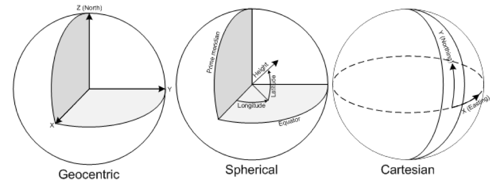
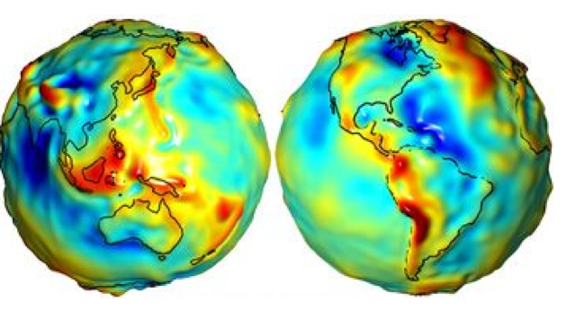

GIS data preparation
========================

Once all necessary layers have been succesfully acquired, the user would need to prepare the datasets for their input into the OnSSET model. This requires the creation of a .csv file. There are four steps that need to be undertaken to process the GIS data so that it can be used for an OnSSET analysis.

**Step 1. Proper data types and coordinate system**
---------------------------------------------------

In this first step the user would need to secure all the datasets. Before starting the analysis make sure that all datasets have the same coordiante system (preferably **World Geodetic Datum 1984 (WGS84)**) You can check the coordinate system of your layers by importing them into QGIS and then right-clicking on them and open the **Properties** window. In the Properties window go to the **Information** tab, here the coordinate system used is listed under *CRS* for both rasters and vectors.

**Step 2. Layer projection**
---------------------------------------------------

In this step the user would need to determine the projection system he/she wish to use. Projection systems always distort the datasets and the system chosen should be one that minimizes this distortion. **Do not** manually project the datasets yourself (the extraction plugin presented below does this for you) it is however good to have an idea of which system to use before starting to work with the datasets.
Here follows a few important key aspects:

**Projection** is the systematic transformation of the latitude and longitude of a location into a pair of two dimensional coordinates or else the position of this location on a plane (flat) surface. A projection is necessary every time a map is created and all map projections distort the surface in some fashion.

**Coordinate System:** Simply put, it is a way of describing a spatial property relative to a center.

**Datum:** The center and orientation of the ellipsoid

**Step 3. Generate population clusters**
---------------------------------------------------

Once the previous steps are finished we can generate our population clusters. These clusters represents settlements and will set the base of your OnSSET analysis. To generate the clusters you need the three following dataset: Administratvie boundaries (polygon vector), Population (raster) and night-time lights (raster). In order to facilitate the cluster generation KTH-dES has developed QGIS based plugins available `here <https://github.com/OnSSET/PopCluster>`_

In the repository go to the **Plugin** folder and select the option that you wish to use. Currently there are four options to choose from:

    * Option 1. Plugin developed for QGIS 3.10 (the latest stable version) and works with HRSL
    * Option 2. Plugin developed for QGIS 3.4 and works with HRSL
    * Option 3. Plugin developed for QGIS 3.2 and works with HRSL
    * Option 4. Plugin developed for QGIS 3.2 and works with GHS

Once you have selected the option you wish to use, download the file named hrsl_clustering.zip. In order to install and use the plugin please refer to the instructions published in its `repository <https://github.com/OnSSET/PopCluster>`_. 

**Step 4. Generate the OnSSET input file**
---------------------------------------------------
Once the clusters are generated, we can combine all layers together into a single table.
The principle is simple. We will use the clusters from **Step 3** in order to create a base table.
Every row in this table represents a population settlement. Then, we will adhere one by one all the layers
into this table so that every row (settlement) acquires its specific characteristics based on its location.
One can perform the process manually by identifying the tools in the GIS environment of his/her preference.

In order to facilitate the process KTH-dES has prepared a set of QGIS plugins that can be used. The plugin is available in the **Plugin** folder in the following `repository <https://github.com/OnSSET/ClusterbasedExtraction>`_. 

There are three options: 

    * Option 1. Works for QGIS 3.10 (latest LTR)
    * Option 2. Works for QGIS 3.4
    * Option 3. Works for QGIS 3.2
    
Choose the one that suits you, download the corresponding .zip-file named gep_onsset and follow the instructions in its `repository <https://github.com/OnSSET/ClusterbasedExtraction>`_ in order to intall and run the plugin. 

GIS country file
------------------------------
The table below shows all the parameters that should be sampled and put into the csv file representing the study area.

+-----------------------------+----------------------------------------------------------------------------------------------------------------------------------------------------------+
| **Parameter**               | **Description**                                                                                                                                          |
+=============================+==========================================================================================================================================================+
| Country                     | Name of the country                                                                                                                                      |
+-----------------------------+----------------------------------------------------------------------------------------------------------------------------------------------------------+
| Nigthlights                 | Maximum light intensity observed in cluster                                                                                                              |
+-----------------------------+----------------------------------------------------------------------------------------------------------------------------------------------------------+
| Pop                         | Population of cluster                                                                                                                                    |
+-----------------------------+----------------------------------------------------------------------------------------------------------------------------------------------------------+
| id                          | Id of cluster, important when generating maps                                                                                                            |
+-----------------------------+----------------------------------------------------------------------------------------------------------------------------------------------------------+
| GridCellArea                | Area of each cluster (km2)                                                                                                           			 |
+-----------------------------+----------------------------------------------------------------------------------------------------------------------------------------------------------+
| ElecPop                     | Population that lives in areas with visible night-time lights                                                          					 |
+-----------------------------+----------------------------------------------------------------------------------------------------------------------------------------------------------+
| WindVel                     | Wind speed (m/s)                                                                                                                                         |
+-----------------------------+----------------------------------------------------------------------------------------------------------------------------------------------------------+
| GHI                         |      Global Horizontal Irradiation (kWh/m2/year)                                                                                                         |
+-----------------------------+----------------------------------------------------------------------------------------------------------------------------------------------------------+
| TravelHours                 | Distance to the nearest town (hours)                                                                                                                     |
+-----------------------------+----------------------------------------------------------------------------------------------------------------------------------------------------------+
| ResidentialDemandTierCustom | Indicative residential electricity demand target                                                                                                         |
+-----------------------------+----------------------------------------------------------------------------------------------------------------------------------------------------------+
| Elevation                   | Elevation from sea level (m)                                                                                                                             |
+-----------------------------+----------------------------------------------------------------------------------------------------------------------------------------------------------+
| Slope                       | Ground surface slope gradient (degrees)                                                                                                                  |
+-----------------------------+----------------------------------------------------------------------------------------------------------------------------------------------------------+
| LandCover                   | Type of land cover as defined by the source data                                                                                                         |
+-----------------------------+----------------------------------------------------------------------------------------------------------------------------------------------------------+
| CurrentHVLineDist           | Distance to the closest existing HV line (km)                                                                                                   	 |
+-----------------------------+----------------------------------------------------------------------------------------------------------------------------------------------------------+
| CurrentMVLineDist           | Distance to the closest existing MV line (km)                                                                                                    	 |
+-----------------------------+----------------------------------------------------------------------------------------------------------------------------------------------------------+
| PlannedHVLineDist           | Distance to the closest planned HV line (km)                                                                                                             |
+-----------------------------+----------------------------------------------------------------------------------------------------------------------------------------------------------+
| PlannedMVLineDist           | Distance to the closest planned MV line (km)                                                                                                		 |
+-----------------------------+----------------------------------------------------------------------------------------------------------------------------------------------------------+
| TransformerDist             | Distance from closest existing transformers (km)                                                                                                         |
+-----------------------------+----------------------------------------------------------------------------------------------------------------------------------------------------------+
| SubstationDist              | Distance from the existing sub-stations (km)                                                                                                             |
+-----------------------------+----------------------------------------------------------------------------------------------------------------------------------------------------------+
| RoadDist                    | Distance from the existing road network (km)                                                                                                 		 |
+-----------------------------+----------------------------------------------------------------------------------------------------------------------------------------------------------+
| HydropowerDist              | Distance from closest identified hydropower potential (km)                                                                                               |
+-----------------------------+----------------------------------------------------------------------------------------------------------------------------------------------------------+
| Hydropower                  | Closest hydropower technical potential identified                                                                                                        |
+-----------------------------+----------------------------------------------------------------------------------------------------------------------------------------------------------+
| HydropowerFID               | ID of the nearest hydropower potential                                                                                                                   |
+-----------------------------+----------------------------------------------------------------------------------------------------------------------------------------------------------+
| X_deg                       | Longitude                                                                                                              					 |
+-----------------------------+----------------------------------------------------------------------------------------------------------------------------------------------------------+
| Y_deg                       | Latitude                                                         										 	 |
+-----------------------------+----------------------------------------------------------------------------------------------------------------------------------------------------------+
| IsUrban                     | All 0 after extraction, urban/rural split gets assigned in the algorithm                                                                                 |
+-----------------------------+----------------------------------------------------------------------------------------------------------------------------------------------------------+
| PerCapitaDemand             | Indicative residential electricity demand target                                                                                                         |
+-----------------------------+----------------------------------------------------------------------------------------------------------------------------------------------------------+
| HealthDemand                | Indicative electricity demand for health 														 |
+-----------------------------+----------------------------------------------------------------------------------------------------------------------------------------------------------+
| EducationDemand             | Indicative electricity demand for educational facilities                                                                                                 |
+-----------------------------+----------------------------------------------------------------------------------------------------------------------------------------------------------+
| AgriDemand                  | Indicative electricity demand for agricultural processes                                                                                                 |
+-----------------------------+----------------------------------------------------------------------------------------------------------------------------------------------------------+
| ElectrificationOrder        | Indicates order of electrification; retrieved by grid extension algorithm; default =0                                                                    |
+-----------------------------+----------------------------------------------------------------------------------------------------------------------------------------------------------+
| Conflict                    | Indicator of level of conflict (default =0; otherwise option 1-4)                                                                                        |
+-----------------------------+----------------------------------------------------------------------------------------------------------------------------------------------------------+
| CommercialDemand            | Indicative electricity demand target for commercial activity                                                                                             |
+-----------------------------+----------------------------------------------------------------------------------------------------------------------------------------------------------+
| ResidentialDemandTier1      | Indicative residential electricity demand target equal to Tier 1                                                                                         |
+-----------------------------+----------------------------------------------------------------------------------------------------------------------------------------------------------+
| ResidentialDemandTier2      | Indicative residential electricity demand target equal to Tier 2                                                                                         |
+-----------------------------+----------------------------------------------------------------------------------------------------------------------------------------------------------+
| ResidentialDemandTier3      | Indicative residential electricity demand target equal to Tier 3                                                                                         |
+-----------------------------+----------------------------------------------------------------------------------------------------------------------------------------------------------+
| ResidentialDemandTier4      | Indicative residential electricity demand target equal to Tier 4                                                                                         |
+-----------------------------+----------------------------------------------------------------------------------------------------------------------------------------------------------+
| ResidentialDemandTier5      | Indicative residential electricity demand target equal to Tier 5                                                                                         |
+-----------------------------+----------------------------------------------------------------------------------------------------------------------------------------------------------+

.. note::
    It is very important that the columns in the csv-file are named exactly as they are namned in the **Parameter**-column in the table above.
