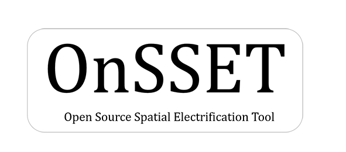

.. Test documentation master file, created by
   sphinx-quickstart on Wed Jul 26 10:01:56 2017.
   You can adapt this file completely to your liking, but it should at least
   contain the root `toctree` directive.

Welcome to OnSSET's documentation!
===================================

Introduction to OnSSET
======================

OnSSET is a bottom-up medium to long term optimization model. Its principle is simple. Using population settlements together with different geospatial characteristics and socio- and tecno-economic data the tool tries to identify the least-cost supply option in order to reach universial electrification in each location.

The least-cost technology mix and investments required to fully electrify a country within a defined timeframe (e.g. 2030) can vary significantly depending on demand and supply characteristics, such as:

1)  The level of electricity access to be achieved in a country (kWh/person/year).

2)  The current status and plans of the national electricity grid along with its associated costs.

3)  Local energy resource availability and off-grid power systems costs.

Starting in 2015 at the division of Energy Systems at KTH (formerly division of Energy Systems Analysis) OnSSET was developed by embracing the advancements in the geospatial field, and developing together with partners an open-source, geospatial electrification toolkit – the Open Source Spatial Electrification Tool (OnSSET). OnSSET is a GIS  based tool developed to identify the least-cost electrification option(s) between six alternative configurations:

* Grid connection/extension
* Mini grid systems (Based on Solar PV, Wind Turbines or Small scale hydropower, using batteries and/or diesel for backup)
* Stand-alone systems (Solar Home Systems)

The results indicate the technology mix, capacity and investment requirements for achieving universal access in the modelled country, under a certain time period (usually until 2030). The findings can be presented in various formats such as interactive maps, graphs, images, tables etc.

Scope and Objective
*******************
OnSSET output, can be used to support policy development for electrification by taking into consideration specific guidelines and targets for each country. This, could help answer questions like:

* What would it cost to provide universal electricity access in the country? How does this cost change based on the targeted consumption level per capita?
* In case of limited resources, which customers/areas shall be prioritized? What key consumers should electrification activities focus on?
* What part of population lives within 50 km from the existing grid infrastructure and what part in remote (last-mile) communities?
* What is the most cost effective way to electrify populations in the last mile, what technologies and costs would that imply?
* How do diesel generators compare with off grid renewables (solar PV, wind, hydro) in terms of overall economic performance? What are the implications of an imminent carbon pricing scheme?
* What is the importance/impact of diesel price in the generation mix for electrification?
* How does fuel cost for diesel compares with high upfront cost of renewables in terms of subsidy schemes (continuous vs one-time subsidy)?

To the current state, OnSSET has supported electrification efforts in many countries around the globe including Afghanistan, Nigeria, Ethiopia, Kenya, India, Tanzania, Madagascar, Mozambique and Benin as part of joint collaboration with the World Bank, the United Nations, SNV and other. These organizations, have warmly embraced the tool in their fight against energy poverty. In addition, OnSSET has featured in several peer reviewd publications including the World Energy Outlook in 2014, 2015, 2017 and 2019, 2022.

.. figure::  img/optimusnew.png
   :align:   center

Contents
+++++++++++++++++++++

.. toctree::
   :maxdepth: 3

   Introduction <introduction>
   OnSSET_model
   Installation <installation>
   data_acquisition
   data_preparation
   otherinputs
   running
   analysis_visualization
   Applications <applications>
   References <references>
   Contact <contact>
   Frequently Asked Questions <faq>
   License <license>
   Module Reference <api/modules>

Indices and tables
==================

* :ref:`genindex`
* :ref:`modindex`
* :ref:`search`
