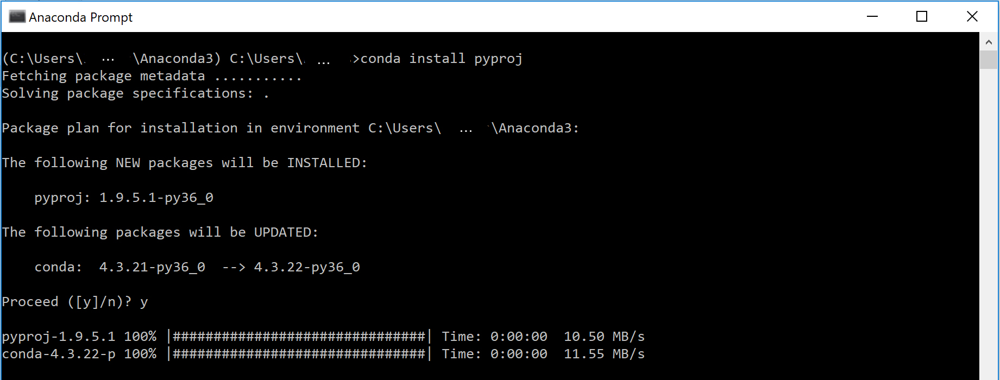
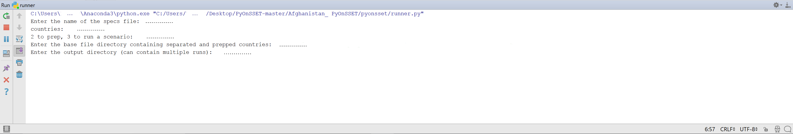

Running the analysis
====================================

Setting up PyCharm - Afghanistan Demo
***************************************

1.	Download the code from **GitHub** `here <https://github.com/OnSSET/OnSSET>`_.

Select “Download ZIP” from the "Clone or Download" tab and save the zipped folder on your Desktop. Unzip it and open the “Afghanistan_PyOnSSET” folder. If not already there, create a folder and name it “run”. This folder will contain the final output with the results.

2.	Download the “Afghanistan.csv” dataset from here (to be updated) and save it in “~/PyOnSSET-master/Afghanistan_PyOnSSET/db”.

3. Once you have successfully completed all the previous steps, open **PyCharm** or any other Python IDE framework.  Select "Open" and then select “~/Desktop/PyOnSSET-master/Afghanistan_PyOnSSET” as your working directory as shown below:

.. image:: img/fig1.png
            :width: 200px
            :height: 150px
            :align: center

4. Go to *File*->*Default Settings*->*Project Interpreter* and from the drop-down list select the Anaconda directory which we installed in the previous steps. Once all the packages load, click Apply and OK.

.. image:: img/fig2.jpg
            :width: 600px
            :height: 150px
            :align: center

5. Once you have set your working directory, select “pyonsset”, and from the drop-down menu double-click on a) onsset.py and b) runner.py in that order, in order to open them.

.. image:: img/fig3.png
            :width: 200px
            :height: 150px
            :align: center

6. Now that you have opened “onsset.py”, right-click on its tab and click on “Create/Select ‘onsset’…”.

.. image:: img/fig4.png
            :width: 300px
            :height: 300px
            :align: center
.. note::

        * In the configuration window, make sure that the Anaconda interpreter is selected in the “Python interpreter” option before you click OK.

        .. image:: img/fig5.jpg
            :width: 600px
            :height: 200px
            :align: center

        * You are now ready to run “onsset.py” by clicking the Run button at the upper-right corner of your window.

        .. image:: img/fig6.png
            :width: 200px
            :height: 40px
            :align: center

        *  Repeat the same steps explained above for “runner.py” only if you get a “Process finished with exit code 0” message in the built-in console. Otherwise, move to step 7 before you run “runner.py”.

7. After running a python script, the output is shown in the console built in PyCharm.

        *   If you get a “Process finished with exit code 0” message, that means that everything worked OK.

        *   Otherwise, the console shows messages with errors or warnings. In case you get a “Module Not Found Error” message, that means that a module or package is missing.

Installing/updating modules and packages
************************************************

1.  Using Anaconda

Search for “Anaconda Prompt” in your Windows Search. In the command line, type ``conda install <package name>`` and the installation/update will go through automatically. (Note: In the Proceed ([y]/[n])? prompt, type “y”).

e.g. installation of module “pyproj”

2.  pip

**pip** is a package management system used to install and manage software packages written in Python. Search for “Command Prompt” in your Windows Search. Using the command line, navigate to your Python directory and then type “pip” and enter. This will show you all the possible choices you have within pip.

    *   In order to update pip itself you can just type ``pip install  --upgrade pip``.

    .. image:: img/fig8.png
            :width: 600px
            :height: 150px
            :align: center

    *   In order to install any additional module required you can type ``pip install <package name>``.

        e.g. installation of module “matplotlib” ``pip install matplotlib``

    .. image:: img/fig9.png
            :width: 600px
            :height: 150px
            :align: center

3. Directly in PyCharm

    Go to the project interpreter (*File>Settings>Project Interpreter*). Click on the green plus-sign in the upper right corner.

    .. image:: img/A3.jpg
            :align: center

    Search for the required package and click *Install Package*.

Running the code
************************

There are two Python codes that are required to run the analysis; **onsset.py** and **runner.py**.

**onsset.py** defines most of the functions and calculations behind the analysis. Running this code however does not perform
the analysis. **runner.py** is the code that actually executes the analysis. When running this code the user will be propmpted
to enter several inputs, explained below, and runner.py will then retrieve the functions from onsset.py.

.. note::

    Please make sure to:
        *   Not edit or modify in any way your input/output .csv files unless required.
        *   Close any open .csv files before running the programs.

Two changes in the Python code may be required to be able to run the analysis.

Line 8 in runner.py may be changed from ``from pyonsset.onsset import *`` to ``from onsset import *`` if runner.py and
onsset.py are saved in the same folder.

In runner.py line 11, change directory from db to the one where the .csv file containing the prepared GIS data and the
specs file are stored. The line should then look like e.g. ``os.chdir('C:/Desktop/Afghanistan_PyOnSSET/db')``.

OnSSET is then ready to be executed. Press run and enter the specified information when prompted. The runner will appear
at the bottom of the window and look like:

First the program will ask for the name of the specs file. Enter the name of the specs file and press enter, and remember to include the file extension. The specs
file should be an excel file, and the entry should therefore be e.g. ``Specs.xlsx``.

Secondly the countries of the study are required. Enter the name of the country and press enter. If more than one country
are included in the study enter the names of all countries separated by a blank space (Example: ``Afghanistan Pakistan``)

.. note::
        Python is sensitive to upper and lower case letters. Always make sure that names of files, directories and countries
        are matching exactly when running the code and entering information.

The name of the specs file and the country names need to be entered every time. The rest of thecode has been divided into
three parts with different functionalities. Next you will be asked to ``'Enter 1 to split, 2 to prep, 3 to run a scenario: '``.
The function of the three options are to:

1. Split a csv file containing GIS data for multiple countries into csv files that each has the data for one of the countries.
If the original .csv file is for one country only this step can be skipped.

2. Calculate some initial data needed for the electrification analysis, such as projected population, wind capacity factors etc.
This step needs to be run only once to use OnSSET for one area.

3. Perform the electrification analysis. Once the previous steps have been run the third part can be run multiple times to examine
scenarios with e.g. different electricity access targets or fuel costs.

**Step 1: Split**
When prompted, enter the name of the file containing data for multiple countries and press enter. Example: ``Countries.csv``.
Again remember to include the file extension.

Next enter the directory where the new files should be saved. This can be the same directory as the file containing all the countries
or a new one with separated countries only e.g. ``C:/Desktop/Afghanistan_PyOnSSET/db/countryfiles``. A new directory is recommended
to prevent overwriting of the original .csv file if it is named after a country.

OnSSET then creates new .csv files with data for each country. The files will be stored with the name of the country
followed by the .csv extension, e.g. Afghanistan.csv.

**Step 2: Prep**
The preparation step starts by prompting the user to enter the directory where the separated country files are saved.
If selection 1 was executed the entry should be the one specified for output in selection 1 (``C:/Desktop/Afghanistan_PyOnSSET/db/countryfiles``),
otherwise it is the directory where the original .csv file is stored (e.g. ``C:/Desktop/Afghanistan_PyOnSSET/db``).
If selection 1 has not been executed the csv file must be named country.csv (e.g. Afghanistan.csv) or OnSSET will not be able
to find it.

For each country chosen initially the prepping will be executed and the .csv file with GIS data will be overwritten in
the same folder with a new file with the same name (e.g. Afghanistan.csv) containing additional information. The specsfile
is overwritten as well with updated data for *MaxGridDist*, *MinNightLights* and *MaxRoadDist* as well as *ElecModelled*
which is the calculated value for the electrified population in the base year. After running step 2, open the specs file to
check if *ElecModelled* is sufficiently close to *ElecActual*. If not, change tha values of *MaxGridDist*, *MinNightLights*, *MaxRoadDist*,
*PopCutOffRoundOne* and/or *PopCutOffRoundTwo* and run step 2 again until *ElecModelled* is sufficiently close to *ElecActual*.

**Step 3: Run scenario(s)**
In the third selection the electrification scenarios are run. This part of the code need to be run once for every scenario.
The user is first prompted to specify where the prepped files from selection 2 are saved. Enter the same as was entered in
selection 2. Secondly the user is prompted to enter where the result files should be saved. The result files will save as
*Scenario_Tier_Dieselchoice.csv* and *Scenario_Tier_Dieselchoice.csv* (Example: Afghanistan_1_High.csv for a Tier 1 analysis
with high diesel price).

The following step is to enter the electricity target simply by typing the tier number between 1-5 and pressing enter for
urban and rural areas respectively. The annual household electricity consumption is displayed in the terminal:

.. image:: img/A1.png
            :align: center

Next step is to choose between the high and low diesel price from the specs file. For the question ``Use high diesel value? <y/n> ``
enter ``y`` to use the high diesel cost or ``n`` to use the low diesel cost.

The final input required before running the analysis is if a result file should be created for each country in the analysis
or if a combined result file should be created: ``Combine countries into a single file? <y/n>``. Enter ``y`` to combine or
``n`` to generate separate files. Following this step the electrification analysis is executed.

.. note::

        Sometimes it may be of interest to run scenarios with the same energy tier and diesel price while changing other
        variables such as the discount rate. In a case with two runs with the same energy tier and diesel price the first
        result files will be overwritten. Remember to move or rename them before initiating the second run.
