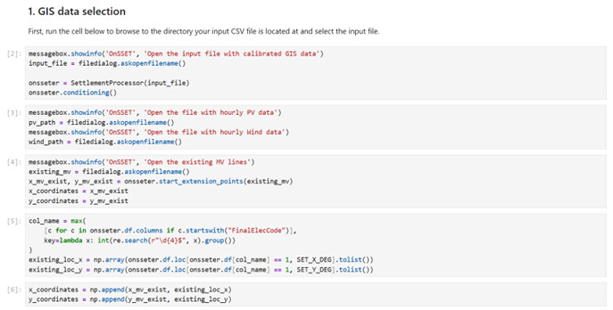
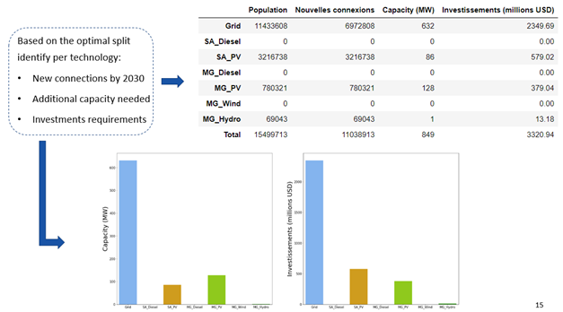

Running an OnSSET scenario
==========================

After GIS-extraction and calibration of the input file, it is finally time to run a scenario using OnSSET to identify
the least-cost technologies to meet access targets. This is done using the Jupyter Notebook called *2. OnSSET_Scenario.ipynb*
which is found among the `main OnSSET codes <https://github.com/OnSSET/onsset>`_.

To launch the Jupyter Notebook, open **Anaconda Prompt** and run:

.. code-block:: bash

   cd PATH
   conda activate onsset_env
   jupyter notebook

Replace ``PATH`` with the location where you downloaded and extracted the
main **OnSSET** code.

First, open the **1. OnSSET_Calibration notebook**.

This notebook runs the electrification scenarios and determines the
least-cost technology for each settlement.

Run all cells from **top to bottom**.

Start by running the first cells to import the required packages.

Step 1 – GIS Data Selection
---------------------------

Select the following files when prompted.

  * First: OnSSET_InputFile_Calibrated.csv - The calibrated input csv file created in the previous step

  * Then: bj-2-pv.csv (the first two letters are the country code, so the exact name depends on your country) - This file
    contains hourly solar resource values and can be downloaded from `Energydata.info <https://energydata.info/dataset/?q=GEP&page=1>`_
    for 58 countries around the globe. These files have been created using data from `Renewables.ninja <https://www.renewables.ninja/>`_.

  * Then: bj-2-wind.csv (the first two letters are the country code, so the exact name depends on your country) - This file
    contains hourly wind resource values and can be downloaded from `Energydata.info <https://energydata.info/dataset/?q=GEP&page=1>`_
    for 58 countries around the globe. These files have been created using data from `Renewables.ninja <https://www.renewables.ninja/>`_.

  * Finally: Choose a GIS-dataset of existing *and planned* (if there are lines that are already commissioned/under
    construction and should be included in the analysis) MV lines

Step 2 – Modelling Period and Electrification Rate
--------------------------------------------------

In this section, you define the end year of the analysis and the target national electrification rate by that year.

Step 3 – Country-Specific Data
------------------------------

In this step, you can define country-specific demographic and techno-economic parameters.
Check the units closely to ensure you enter data in the correct format.

For an overview of the key techno-economic parameters, please refer to the Excel-file called
**OnSSET v.2.0 -- non-GIS modelling parameters** which is included with the OnSSET code.

Step 4 – Run the Scenario
-------------------------

This step runs the electrification model and calculates the
least-cost technology for every settlement.

.. important::

   This process may take **several minutes to hours** depending on:

   * Country size
   * Computer performance
   * Dataset resolution

Step 5 – Results, Summaries, and Visualization
----------------------------------------------

This section displays:

* Summary tables
* Charts
* A technology map showing electrification solutions

   Example visualization of scenario results.

Picture source: OnSSET teaching material
https://doi.org/10.5281/zenodo.457403 (CC-BY 4.0)

Step 6 – Export Results
-----------------------

1. Name your scenario in the first cell.
2. Run the next cell.
3. Click **OK** in the pop-up window.
4. Select the folder where results should be saved.

Run the final two cells to export:

* Settlement-level results
* National summary results

The file named **Results** can be used to generate maps in **QGIS**, as described in the next section.